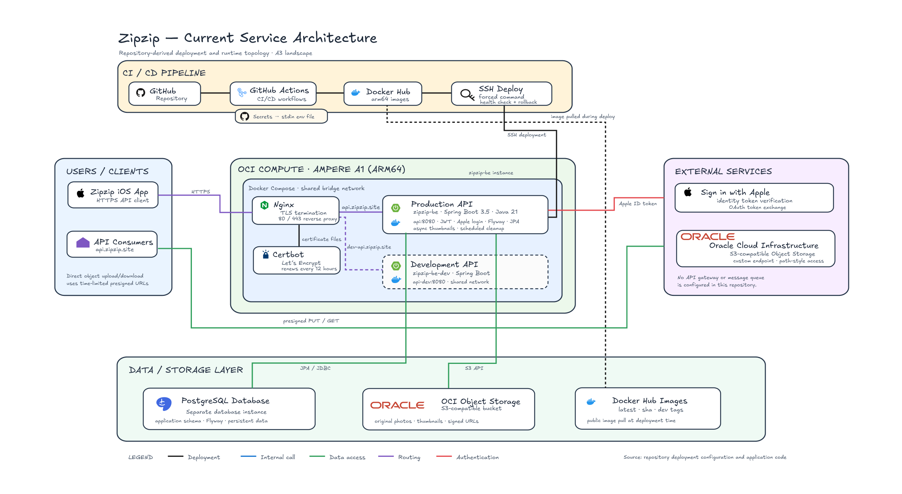

<h1>
   zipzip
</h1>

> 메인폰 밖에서 촬영된 사진을 더 쉽게 찾고, 분류하고, 다시 볼 수 있도록 돕는 사진 정리 보조 서비스

서브폰·카메라 등 여러 기기로 촬영한 사진이 한 라이브러리에 섞여 있으면 원하는 사진을 다시 찾기 어렵습니다. **zipzip**은 사용자의 사진 라이브러리를 분석해 **촬영 기기·날짜·장소 기준으로 사진을 자동 인덱싱**하고, 이를 바탕으로 필터링·앨범 정리·그룹 공유까지 이어지는 정리 경험을 제공하는 iOS 앱입니다.

## 📱 미리보기


| 공유 | 공유 채팅 |
| :---: | :---: |
|  |  |


## ✨ 주요 기능

| 기능 | 설명 |
| --- | --- |
| 인증 | Sign in with Apple 로그인, JWT Access/Refresh Token 발급·회전, 로그아웃 |
| 사용자 | 내 프로필 조회·수정, 회원 탈퇴 |
| 공유 그룹 | 그룹 생성·조회·수정·삭제, 초대 코드 미리보기·참여·탈퇴, 멤버 조회와 역할 기반 권한 관리 |
| 공유집(앨범) | 그룹별 앨범 생성·조회·수정·삭제, 여러 앨범 일괄 삭제 |
| 사진 | Object Storage 직접 업로드용 presigned URL 발급, 업로드 완료 등록, 조회·메타데이터 수정·삭제 |
| 사진 분류 | 하나의 사진을 여러 앨범에 첨부하거나 분리하는 N:M 구조 |
| 반응 | 사진 상세 조회, 좋아요 설정·취소, 댓글 조회·작성 |
| 채팅 | 공유 그룹의 텍스트 메시지와 사진 댓글 활동을 하나의 커서 기반 타임라인으로 조회 |
| 데이터 수명주기 | 주요 리소스 soft delete, 만료 데이터·스토리지 객체·실패한 썸네일의 주기적 정리 및 재처리 |

### 설계 방향

- **제어 평면과 데이터 평면 분리:** API 서버는 권한·메타데이터·임시 URL을 관리하고, 사진 원본은 iOS 클라이언트가 Object Storage에 직접 업로드합니다.
- **DB를 진실의 원천으로 사용:** PostgreSQL의 상태를 기준으로 처리하며, 스토리지와의 결과적 일관성은 주기적 스윕으로 보완합니다.
- **무거운 작업은 비동기로 처리:** 썸네일 생성은 제한된 전용 스레드 풀에서 실행하고, 실패하거나 유실된 작업은 DB 상태를 바탕으로 재시도합니다.
- **REST와 폴링 중심의 단순한 구조:** 별도 WebSocket 계층 없이 커서 기반 증분 조회로 채팅과 활동 피드를 제공합니다.
- **공개 API 계약 우선:** iOS 팀이 Swagger와 `docs/apidoc/` 문서를 API 명세로 사용할 수 있도록 요청·응답과 오류 코드를 함께 관리합니다.

## 🛠 기술 스택

### Application

<p>
  
  
  
  
</p>

### Data & Storage

<p>
  
  
  
  
  
</p>

### API & Quality

<p>
  
  
  
  
  
</p>

### Infrastructure & Collaboration

<p>
  
  
  
  
  
</p>

### 기술 선정 이유

| 구분 | 기술 | 선정 이유 |
| --- | --- | --- |
| 언어 | Java 21 | 장기 지원 버전과 Spring 생태계를 활용하고 최신 JVM 기능을 사용할 수 있습니다. |
| 프레임워크 | Spring Boot 3.5 | 웹·보안·검증·데이터 접근을 일관된 구성으로 제공하며 팀 내 생산성이 높습니다. |
| 데이터베이스 | PostgreSQL | 관계 무결성, 트랜잭션, 고급 인덱스와 제약조건으로 공유 데이터의 정합성을 보장합니다. |
| 스키마 관리 | Flyway | 애플리케이션과 함께 버전별 스키마 변경 이력을 재현할 수 있습니다. |
| 파일 저장 | OCI Object Storage | 대용량 원본을 서버가 중계하지 않고 S3 호환 presigned URL로 직접 전송할 수 있습니다. |
| 인증 | Sign in with Apple + JWT | iOS 사용자에게 자연스러운 로그인 경험을 제공하고 서버 세션을 stateless하게 유지합니다. |
| API 문서 | springdoc-openapi | 코드와 Swagger 문서의 간극을 줄이고 iOS 팀이 실행 가능한 계약을 확인할 수 있습니다. |
| 테스트 | JUnit 5 + Testcontainers | 순수 단위 테스트와 실제 PostgreSQL 기반 통합 테스트를 목적에 맞게 분리할 수 있습니다. |
| 배포 | Docker + GitHub Actions | 동일한 이미지를 검증·배포하고 헬스체크 실패 시 이전 이미지로 되돌릴 수 있습니다. |

## 🏗️ 시스템 아키텍처



## 🗄️ DB 설계

최신 ERD와 테이블 관계는 dbdocs에서 확인할 수 있습니다.

[](https://dbdocs.io/embed/cf956a90274133517f45d2affd1add14/ecdf7220e60f4c4887f38ca90ab7ef21)

## 📁 폴더 구조

```text
zipzip-server/
├── src/
│   ├── main/
│   │   ├── java/org/zipzip/zipzipserver/
│   │   │   ├── domain/
│   │   │   │   ├── auth/          # Apple 로그인, JWT, Refresh Token
│   │   │   │   ├── user/          # 사용자 프로필과 탈퇴
│   │   │   │   ├── sharedgroup/   # 공유 그룹, 초대, 멤버
│   │   │   │   ├── album/         # 공유집(앨범)과 사진 매핑
│   │   │   │   ├── photo/         # 사진 업로드·조회·썸네일
│   │   │   │   ├── reaction/      # 좋아요와 댓글
│   │   │   │   ├── chat/          # 그룹 채팅·활동 타임라인
│   │   │   │   └── storage/       # Object Storage 추상화와 S3 구현
│   │   │   └── global/            # 보안, 공통 응답, 예외, 커서, 멱등성
│   │   └── resources/
│   │       ├── application.yaml
│   │       ├── config/             # 비공개 설정 Git 서브모듈
│   │       └── db/migration/       # Flyway 마이그레이션
│   └── test/                        # 단위·통합·계약·벤치마크 테스트
├── docs/
│   ├── apidoc/                      # API 계약과 설계 결정
│   ├── architecture/                # 백엔드 아키텍처
│   └── data-modeling/               # 용어, 모델, 데이터 사전, DBML
├── deploy/                           # 운영·개발 Docker Compose와 Nginx 설정
├── postman/                          # API 요청 컬렉션
├── docker-compose.yml                # 로컬 PostgreSQL
└── build.gradle
```

## 🚀 로컬 실행

### 요구 사항

- JDK 21
- Docker 및 Docker Compose
- 비공개 설정 저장소 `zipzip-server-config` 접근 권한

### 1. 저장소와 설정 내려받기

```bash
git clone --recurse-submodules https://github.com/zipzip-team/zipzip-server.git
cd zipzip-server
```

이미 저장소를 복제했다면 서브모듈을 별도로 초기화합니다.

```bash
git submodule update --init --recursive
```

### 2. PostgreSQL 실행

```bash
docker compose \
  --env-file src/main/resources/config/docker-compose.env \
  up -d
```

`application-secret.yml`의 datasource 설정과 `docker-compose.env`의 DB 설정은 서로 일치해야 합니다. 민감한 설정 파일은 메인 저장소에 커밋하지 않습니다.

### 3. 서버 실행

```bash
./gradlew bootRun
```

서버가 실행되면 다음 주소에서 상태와 API 문서를 확인할 수 있습니다.

- Health Check: [http://localhost:8080/actuator/health](http://localhost:8080/actuator/health)
- Swagger UI: [http://localhost:8080/swagger-ui/index.html](http://localhost:8080/swagger-ui/index.html)
- OpenAPI JSON: [http://localhost:8080/v3/api-docs](http://localhost:8080/v3/api-docs)

### 4. 검증

```bash
./gradlew check
```

```bash
./gradlew spotlessApply
./gradlew spotlessCheck
```

Gradle 명령은 JDK 21로 실행해야 합니다. 로컬 기본 JDK가 다른 경우 `JAVA_HOME`을 JDK 21 경로로 지정합니다.

## 📚 문서

| 문서 | 내용 |
| --- | --- |
| [API 명세 인덱스](docs/apidoc/00-api-index.md) | API별 계약 문서와 구현 상태 |
| [공통 API 규격](docs/apidoc/01-common-spec.md) | 인증, 공통 응답, 오류, 페이지네이션 규칙 |
| [백엔드 아키텍처](docs/architecture/backend-architecture.md) | 핵심 설계 결정과 런타임·배포 구조 |
| [데이터 모델링](docs/data-modeling/04-data-modeling.md) | 엔티티 관계와 데이터 모델 |
| [데이터 사전](docs/data-modeling/05-data-dictionary.md) | 테이블·컬럼·제약조건 정의 |
| [코드 포매팅](docs/code-formatting.md) | Spotless와 Java 포맷 규칙 |
| [배포 파이프라인](docs/deployment-pipeline.md) | CI/CD 구성과 배포 흐름 |

## 🤝 Convention

### Branch

일반 작업 브랜치는 `<type>/<issue-number>-<summary>` 형식을 사용합니다.

```text
feat/2-user-login
fix/15-refresh-token-expiration
chore/42-update-dependencies
```

`main`, `develop`에는 직접 push하지 않고 작업 브랜치에서 Pull Request를 생성합니다.

### Commit Message

커밋 메시지는 `:<gitmoji_code>: <type>: <한국어 요약>` 형식을 사용합니다.

```text
:sparkles: feat: Apple 로그인 기능 구현
:bug: fix: Refresh Token 만료 처리 수정
:memo: docs: API 명세 업데이트
```

커밋 전 저장소의 Git hook을 사용하도록 설정합니다.

```bash
git config core.hooksPath .githooks
```

## 👥 Members

<div align="center">

<table>
  <tr>
    <td align="center" width="230">
      <a href="https://github.com/hamtorygoals">
        
      </a><br/>
      <b>윤해민</b><br/>
      
      <br/><br/>
      <a href="https://github.com/hamtorygoals">
        
      </a>
    </td>
    <td align="center" width="230">
      <a href="https://github.com/jaehunshin-git">
        
      </a><br/>
      <b>신재훈</b><br/>
      
      <br/><br/>
      <a href="https://github.com/jaehunshin-git">
        
      </a>
    </td>
  </tr>
</table>

<sub>© 2026 Team Zipzip</sub>

</div>
