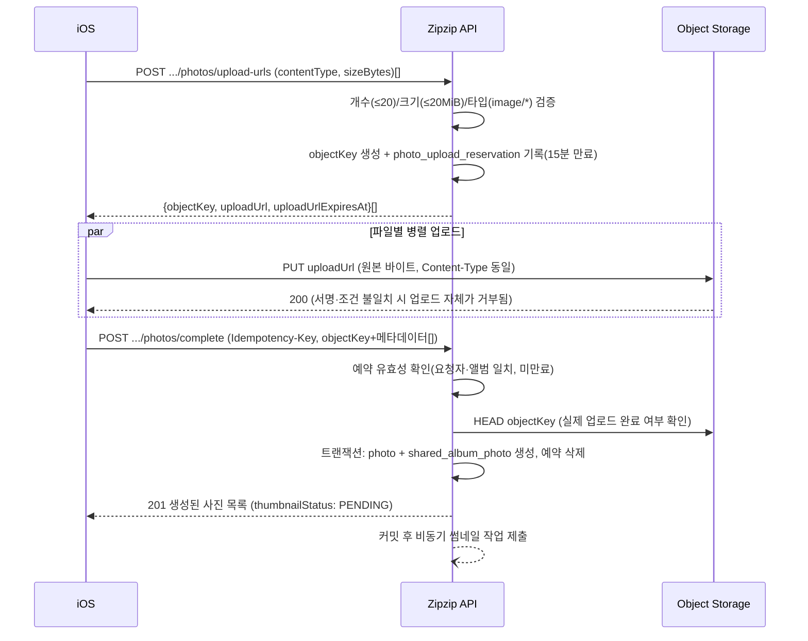

# 공유집(앨범) · 사진 API iOS 연동 가이드

> 이 문서는 [06-shared-album.md](06-shared-album.md), [07-photo-management.md](07-photo-management.md)의 계약을 전제로, 각 엔드포인트에서 **서버가 실제로 하는 일**과 **iOS가 취해야 할 행동**을 화면 흐름 관점에서 정리한 보조 문서다. 필드 단위 요청/응답 스키마나 에러 코드의 최종 근거는 항상 06/07 문서다.
>
> 대상 API: ALBUM-01~06, PHOTO-01~04·PHOTO-07~08 (Object Storage 연동 포함). 작성 시점 기준 서버 구현·수동 검증 완료.

## 1. 공통 사항

### 1.1 인증

모든 API(Apple 로그인 제외)는 `Authorization: Bearer <accessToken>` 헤더가 필수다. 헤더가 없거나 토큰이 만료·위조되면 `401 UNAUTHORIZED`를 반환한다. iOS는 401 수신 시 저장된 refresh token으로 AUTH-02(토큰 갱신)를 먼저 시도하고, 그마저 실패하면 재로그인 화면으로 보낸다.

### 1.2 응답 형식

모든 응답은 `{ status, code, message, data }` 형식(`BaseResponse<T>`)으로 고정이다. 성공/실패 모두 `code`로 분기하고, `data`는 실패 시 보통 `null`이다.

### 1.3 Idempotency-Key

아래 표에 해당하는 POST 엔드포인트만 `Idempotency-Key: <UUID>` 헤더가 **필수**다. 같은 키로 재요청하면 서버는 실제 로직을 다시 실행하지 않고 최초 성공 응답을 그대로 재전송한다(재전송 시 `Idempotency-Replayed: true` 응답 헤더가 붙는다).

| API | Idempotency-Key 필요 |
|---|---|
| ALBUM-01 (목록), ALBUM-03 (상세), ALBUM-04 (이름 수정) | 불필요 |
| **ALBUM-02 (생성)** | **필요** |
| ALBUM-05 (삭제) | 불필요 (DELETE, 자체적으로 멱등) |
| **ALBUM-06 (일괄 삭제)** | **필요** |
| PHOTO-01 (목록), PHOTO-04 (메타데이터 수정) | 불필요 |
| **PHOTO-02 (업로드 URL 발급)** | 불필요 (아직 `photo` 행을 만들지 않아 재시도해도 URL만 다시 발급될 뿐 안전) |
| **PHOTO-03 (완료 등록)**, **PHOTO-07 (추가)**, **PHOTO-08 (제거)** | **필요** |

iOS 구현 규칙: **하나의 논리적 요청(사용자의 한 번의 액션)마다 새 UUID를 생성**하고, 네트워크 오류 등으로 그 요청을 재시도할 때는 **같은 UUID를 재사용**한다. 사용자가 다시 버튼을 눌러 새로운 요청을 보낼 때는 새 UUID를 써야 한다(그렇지 않으면 `409 IDEMPOTENCY_KEY_REUSED`가 날 수 있다).

같은 키로 다른 요청 본문을 보내면 `409 IDEMPOTENCY_KEY_REUSED`, 같은 키의 첫 요청이 아직 처리 중이면 `409 IDEMPOTENCY_REQUEST_IN_PROGRESS`를 반환한다.

### 1.4 커서 페이지네이션

목록 조회(ALBUM-01, PHOTO-01)는 불투명(opaque) 문자열 커서를 쓴다. 첫 호출은 `cursor`를 생략하고, 다음 페이지는 직전 응답의 `nextCursor`를 그대로 다시 보낸다. `hasNext: false`면 마지막 페이지다. `cursor` 형식이 깨졌으면 `400 INVALID_CURSOR`.

### 1.5 Presigned URL 캐시 금지

`originalUrl`/`thumbnailUrl`은 호출마다 새로 서명해 발급하는 임시 URL이며 TTL이 짧다(다운로드 10분, 업로드 15분). 서버는 이 URL을 저장하지 않으므로 iOS도 영구 캐시하지 말고, 화면을 다시 열거나 새로고침할 때 목록/상세 API를 다시 호출해 새 URL을 받아야 한다.

---

## 2. 공유집(앨범) API

### ALBUM-01 — 목록 조회

`GET /api/v1/shared-groups/{sharedGroupId}/shared-albums?cursor=&size=`

**서버 동작**
1. `sharedGroupId`가 존재하고 요청자가 그 그룹의 활성 멤버인지 확인(`SharedAlbumAccessGuard`) — 아니면 `404 SHARED_GROUP_NOT_FOUND`.
2. `createdAt` 내림차순 + 동점 시 앨범 ID 내림차순으로 커서 페이지네이션.
3. 앨범마다 `photoCount`를 그 시점에 실시간 count(비정규화 컬럼 없음 — 저장된 카운터가 아니라 매번 `shared_album_photo` 조인 집계).

**응답 필드**: `items[].{id, name, photoCount, createdBy{userId, displayName}, isCreator, createdAt, updatedAt}`, `nextCursor`, `hasNext`.

**에러**: `400 INVALID_CURSOR`, `404 SHARED_GROUP_NOT_FOUND`.

**iOS 행동**: 공유 그룹 화면 진입 시 호출. 무한 스크롤 시 `nextCursor`를 다음 요청의 `cursor`로. `isCreator`는 "내가 만든 앨범" 표시 등 UI 용도의 참고값일 뿐이며, 삭제 권한과는 무관하다 — 삭제(ALBUM-05/06)는 생성자·방장 여부와 상관없이 상위 공유 그룹의 활성 멤버라면 누구나 가능하므로 삭제 버튼 노출을 `isCreator`로 제한하지 않는다.

### ALBUM-02 — 생성

`POST /api/v1/shared-groups/{sharedGroupId}/shared-albums` (Idempotency-Key 필수)

**서버 동작**
1. 그룹 존재+활성 멤버십 확인.
2. `name`을 trim 후 1~100자 검증 — 위반 시 `400 INVALID_SHARED_ALBUM_NAME`.
3. Idempotency 시작(같은 키 재시도면 여기서 바로 과거 응답 반환).
4. 사진 0개 상태로 앨범 생성, `201 Created`.

**iOS 행동**: "새 공유집 만들기" 버튼 → 이름 입력 모달 → 새 UUID로 `Idempotency-Key` 생성해 호출 → 응답의 `id`를 이후 PHOTO-02/03의 `sharedAlbumId`로 사용. 네트워크 실패로 재시도할 땐 같은 `Idempotency-Key` 유지.

### ALBUM-03 — 상세 조회

`GET /api/v1/shared-albums/{sharedAlbumId}`

**서버 동작**: 앨범 존재 + soft delete 아님 + 요청자가 그 앨범이 속한 그룹의 활성 멤버인지만 확인하는 단순 조회(`SharedAlbumAccessGuard.requireActiveSharedAlbum`). `photoCount`는 ALBUM-01과 동일하게 실시간 count.

**에러**: `404 SHARED_ALBUM_NOT_FOUND` (앨범이 없거나, soft delete됐거나, 멤버십이 없는 경우 모두 이 코드 하나로 통일 — 다른 그룹 멤버에게 앨범 존재 여부를 흘리지 않기 위함).

**iOS 행동**: 앨범 카드를 탭해 들어갈 때 최신 `name`/`photoCount`/`updatedAt` 갱신용으로 호출. 보통 PHOTO-01과 병렬 호출.

### ALBUM-04 — 이름 수정

`PATCH /api/v1/shared-albums/{sharedAlbumId}` (Idempotency-Key 불필요 — PATCH는 같은 이름으로 재요청해도 결과가 같은 자연적 멱등 연산)

**서버 동작**: 활성 멤버라면 **생성자든 아니든** 누구나 수정 가능(방장·멤버 구분 없음, ALBUM-05 삭제와 권한 규칙이 동일하다). 이름 검증 후 갱신하고 `updatedAt` 갱신.

**iOS 행동**: 이름 편집 UI → 저장 시 호출 → 응답 `updatedAt`으로 로컬 캐시 갱신.

### ALBUM-05 — 삭제

`DELETE /api/v1/shared-albums/{sharedAlbumId}` (Idempotency-Key 불필요)

**서버 동작**
1. 상위 공유 그룹의 활성 멤버라면 생성자·방장 여부와 무관하게 누구나 가능(ALBUM-04 이름 수정과 동일한 권한).
2. 앨범을 soft delete(`deletedAt` 기록).
3. 그 앨범의 `shared_album_photo` 매핑을 **즉시 물리 삭제**.
4. 매핑 삭제 결과 소속 앨범이 0개가 된 사진(= 이 앨범이 마지막 소속이었던 사진)은 원본도 함께 soft delete.
5. 앨범 행 자체는 30일 뒤 `SharedAlbumSweepScheduler`가 물리 삭제.

**iOS 행동**: **삭제 확인 다이얼로그 필수.** "이 공유집에만 있던 사진은 함께 완전히 삭제되며 복구할 수 없습니다" 경고. 가능하면 삭제 전에 PHOTO-01로 앨범 내 사진들을 조회해 "다른 공유집에도 있는 사진 N장 / 이 공유집에만 있는 사진 M장"처럼 미리 안내하면 사용자 실수를 줄일 수 있다.

### ALBUM-06 — 일괄 삭제

`POST /api/v1/shared-albums/bulk-delete` (Idempotency-Key 필수)

**서버 동작**
1. 요청 본문 `sharedAlbumIds`(중복 없이 1~100개)를 검증 — 위반 시 `400 INVALID_SHARED_ALBUM_IDS`.
2. Idempotency 시작(같은 키 재시도면 여기서 바로 과거 응답 반환).
3. 대상 전체를 먼저 순회하며 각 앨범의 존재·활성 상태·상위 공유 그룹 활성 멤버십을 검증한다(ALBUM-05와 동일하게 생성자·방장 여부는 확인하지 않는다). **하나라도 실패하면 어떤 앨범도 삭제하지 않고 즉시 `404 SHARED_ALBUM_NOT_FOUND`로 실패**한다.
4. 검증을 통과하면 대상 앨범의 `shared_album_photo` 매핑을 모두 물리 삭제한다.
5. 매핑 삭제 결과 소속 앨범이 0개가 된 사진(대상 앨범들 사이에 걸쳐 있던 사진 포함)은 원본도 함께 soft delete한다.
6. 대상 앨범을 모두 soft delete하고 `deletedAlbumCount`(삭제한 앨범 수)·`deletedPhotoCount`(함께 삭제된 사진 수)를 반환한다. 앨범 행 자체는 30일 뒤 물리 삭제.

**iOS 행동**: 공유 그룹 상세 화면의 선택 모드에서 앨범을 다중 선택 → 삭제 액션 시 선택 개수를 포함한 확인 바텀시트 표시 → 최종 확인 시 선택한 `sharedAlbumIds`로 호출. **하나의 논리적 삭제 요청(바텀시트에서 확인 누른 시점)마다 새 `Idempotency-Key`를 생성**하고 네트워크 재시도에는 같은 키를 재사용한다. 대상 중 하나라도 이미 삭제됐거나(예: 다른 기기에서 방금 삭제) 멤버십을 잃었으면 전체가 `404`로 실패하므로, 실패 시 목록을 새로고침해 최신 상태를 다시 보여준다.

---

## 3. 사진 API

### PHOTO-01 — 목록 조회

`GET /api/v1/shared-albums/{sharedAlbumId}/photos?cursor=&size=`

**서버 동작**
1. 앨범 존재+활성 멤버십 확인(`PhotoAccessGuard.requireActiveSharedAlbum`).
2. `displayAt`(`takenAt`이 없으면 `createdAt`) 내림차순 + 사진 ID 동점 처리로 커서 페이지네이션.
3. 각 항목마다 원본 presigned GET URL을 새로 발급하고, `thumbnailStatus == READY`인 경우에만 썸네일 presigned GET URL도 발급(그 외엔 `null`).
4. `likeCount`/`commentCount`/`isLikedByMe`는 좋아요·댓글 도메인이 이번 범위 밖이라 항상 `0`/`0`/`false`로 반환(하드코딩, 조인 없음).

**iOS 행동**
- 앨범 화면 진입 및 pull-to-refresh 시 호출.
- `thumbnailStatus`별 렌더링: `PENDING` → 플레이스홀더, `READY` → `thumbnailUrl`로 그리드 렌더, `FAILED` → 썸네일 없이 원본(`originalUrl`)만 축소해서라도 표시하거나 별도 아이콘 처리(스윕이 재시도하므로 다음 새로고침에 복구될 수 있음).
- URL이 만료되면(10분) 캐시하지 말고 이 API를 다시 호출.

### PHOTO-02 → 직접 PUT → PHOTO-03 (3단계 업로드 플로우)

#### PHOTO-02 — 업로드 URL 발급

`POST /api/v1/shared-albums/{sharedAlbumId}/photos/upload-urls`

**서버 동작**: 파일마다 `contentType`/`sizeBytes` 검증(개수 1~20, 크기 ≤20MiB, `image/*`만 허용) → 아직 `photo` 행은 만들지 않고 `objectKey`만 생성 → presigned PUT URL을 크기·타입 조건까지 포함해 서명 → `photo_upload_reservation`에 "이 사용자·이 앨범에 15분간 유효"로 기록.

**에러**: `400 INVALID_UPLOAD_METADATA`(형식 오류), `400 TOO_MANY_FILES`(21개 이상), `413 FILE_TOO_LARGE`, `415 UNSUPPORTED_IMAGE_TYPE`, `404 SHARED_ALBUM_NOT_FOUND`.

**iOS 행동**: 올릴 사진들의 `contentType`+`sizeBytes`를 배열로 요청 → 응답 배열(요청과 같은 순서)에서 파일마다 `objectKey`+`uploadUrl` 받아 다음 단계에 그대로 사용.

#### iOS → Object Storage 직접 PUT

서버 API가 아니다. 각 `uploadUrl`로 원본 바이트를 직접 PUT하되 `Content-Type`을 PHOTO-02 요청 때 보낸 값과 **정확히 동일하게** 보내야 한다(다르면 서명 검증 실패로 Object Storage가 업로드 자체를 거부). 서버 대역폭·메모리를 전혀 쓰지 않는 구간이므로 여러 파일은 병렬 업로드를 권장(왕복 감소가 체감 성능을 좌우).

#### PHOTO-03 — 완료 등록

`POST /api/v1/shared-albums/{sharedAlbumId}/photos/complete` (Idempotency-Key 필수)

**서버 동작**: 각 `objectKey`에 대해 (1) 예약이 이 요청자·이 앨범에 발급된 것이 맞고 만료 전인지, (2) Object Storage에 실제로 업로드가 끝났는지(HEAD 체크)를 확인 → 전부 통과해야 **한 트랜잭션**으로 `photo`+`shared_album_photo` 생성, 예약 행 삭제 → 하나라도 실패하면 전체 롤백(부분 성공 없음) → 커밋 성공 후 사진 ID들을 비동기 썸네일 작업 풀에 제출(`thumbnailStatus: PENDING`으로 시작).

**에러**: `400 INVALID_UPLOAD_METADATA`(개수/중복 objectKey 등), `404 UPLOAD_OBJECT_NOT_FOUND`(예약 없음/다른 사용자·앨범 발급/만료), `409 UPLOAD_NOT_COMPLETED`(HEAD 체크 실패, 즉 아직 PUT이 안 끝남).

**iOS 행동**: PUT이 끝난 `objectKey`들과 EXIF에서 뽑은 메타데이터(`deviceModel`, `takenAt`, 위치, `width`/`height`)를 실어 호출. 응답에 사진이 생기지만 `thumbnailUrl`은 아직 `null`(`thumbnailStatus: PENDING`)이므로, 업로더 화면은 로컬 원본을 즉시 낙관적으로 보여주고 몇 초 뒤 PHOTO-01 재조회로 썸네일을 받는 방식을 권장한다. `409 UPLOAD_NOT_COMPLETED`를 받으면 PUT이 아직 끝나지 않았거나 실패한 것이므로, 짧은 재시도 또는 PUT부터 다시 확인해야 한다.

### PHOTO-04 — 메타데이터 수정

`PATCH /api/v1/photos/{photoId}`

**서버 동작**: 업로더 본인만 가능(`403 NOT_PHOTO_UPLOADER`). **필드를 요청 JSON에서 아예 생략하면 기존 값 유지, `null`을 명시하면 그 값을 제거**하는 부분 수정 방식 — 이 구분이 필요해서 서버 바인딩 타입이 고정 DTO가 아니라 `Map<String, Object>`다(Swagger 스키마는 문서화 전용 `PhotoMetadataUpdateRequest`로 별도 노출). 위치 3필드(`latitude`/`longitude`/`locationName`)는 **셋을 함께 보내 갱신하거나 셋 다 생략/`null`로 함께 제거**해야 하며, 일부만 보내면 `400 INVALID_PHOTO_LOCATION`. `takenAt`이 UTC ISO-8601 형식이 아니면 `400 INVALID_TAKEN_AT`.

**iOS 행동**: 촬영일시·위치 수정 UI에서 **바꾸려는 필드만** 요청 본문에 포함하고, 안 바꾸는 필드는 요청에서 아예 빼야 한다(값을 그대로 다시 보내는 것과 무관하게, "빼는 것"과 "null로 보내는 것"은 서버 입장에서 의미가 다르다).

### PHOTO-07 — 기존 사진 추가(attach)

`POST /api/v1/shared-albums/{sharedAlbumId}/photos/attach` (Idempotency-Key 필수)

**서버 동작**: 대상 사진이 이 앨범과 **같은 공유 그룹**에 속해야 함(아니면 `409 PHOTO_NOT_IN_SAME_SHARED_GROUP`) — 다른 그룹 사진은 절대 추가 불가. 원본은 새로 만들지 않고 `shared_album_photo` 매핑만 추가하며, 이미 그 앨범에 속한 사진은 건너뛴다(멱등). 응답에 `attachedCount`(새로 추가)와 `alreadyAttachedCount`(이미 있어서 건너뜀)를 분리해서 반환.

**iOS 행동**: "다른 공유집에도 담기" 같은 기능에서, 같은 그룹 내 다른 앨범 사진들을 골라 호출. `alreadyAttachedCount > 0`이면 "이미 담긴 사진 N장은 건너뛰었어요" 같은 안내에 활용 가능.

### PHOTO-08 — 앨범에서 제거(detach)

`POST /api/v1/shared-albums/{sharedAlbumId}/photos/detach` (Idempotency-Key 필수)

**서버 동작**: 대상 `shared_album_photo` 매핑을 즉시 물리 삭제 → 그 매핑이 마지막 소속이었으면(다른 앨범에도 없으면) 사진 원본도 함께 soft delete. 매핑이 애초에 없으면 그냥 건너뛴다(멱등, 에러 아님). 응답의 `detachedCount`는 실제로 지운 매핑 수, `deletedPhotoCount`는 그중 마지막 소속이라 원본까지 soft delete된 수.

**iOS 행동**: "이 공유집에서만 빼기" 액션 전에, 그 사진이 다른 앨범에도 있는지 미리 확인해서 안내하는 걸 권장(PHOTO-01 응답만으로는 다른 앨범 소속 여부를 알 수 없으므로, 필요하면 별도로 확인 UX를 설계해야 한다). 없으면 원본이 통째로 사라지므로 응답의 `deletedPhotoCount`로 사후에라도 "원본까지 삭제됐다"는 걸 사용자에게 알려줄 수 있다.

---

## 4. 화면별 흐름 요약 (iOS 관점)

| 화면 동작 | 호출 API | Idempotency-Key |
|---|---|---|
| 공유집 목록 진입 | ALBUM-01 | - |
| 새 공유집 만들기 | ALBUM-02 | 필요 |
| 공유집 탭해서 들어가기 | ALBUM-03 + PHOTO-01 | - |
| 공유집 이름 수정 | ALBUM-04 | - |
| 공유집 삭제 | ALBUM-05 (사진 유실 경고 필수) | - |
| 사진 올리기 | PHOTO-02 → 직접 PUT → PHOTO-03 | PHOTO-03만 필요 |
| 그리드 새로고침(썸네일 갱신 포함) | PHOTO-01 | - |
| 사진 상세에서 위치/날짜 수정 | PHOTO-04 | - |
| 여러 장 선택 사진 제거 | PHOTO-08 (마지막 소속 삭제 안내 권장) | 필요 |
| 다른 공유집에 추가 | PHOTO-07 | 필요 |
| 이 공유집에서만 빼기 | PHOTO-08 (경고 권장) | 필요 |

---

## 5. 부록 — 에러 코드 전체표

### 5.1 공통(전 API 공통 적용 가능)

| HTTP | code | 의미 |
|---|---|---|
| 400 | `INVALID_REQUEST` | JSON 파싱·타입 변환·DTO 검증 실패 |
| 401 | `UNAUTHORIZED` | Access Token 누락 또는 서명 불일치/만료 |
| 409 | `IDEMPOTENCY_KEY_REUSED` | 같은 Idempotency-Key로 다른 요청 본문 재사용 |
| 409 | `IDEMPOTENCY_REQUEST_IN_PROGRESS` | 같은 키의 최초 요청이 아직 처리 중 |

### 5.2 공유집(앨범) — `SharedAlbumErrorCode`

| HTTP | code | 의미 | 발생 API |
|---|---|---|---|
| 404 | `SHARED_GROUP_NOT_FOUND` | 공유 그룹 또는 활성 멤버십 없음 | ALBUM-01, 02 |
| 404 | `SHARED_ALBUM_NOT_FOUND` | 앨범 또는 활성 멤버십 없음 | ALBUM-03, 04, 05, 06 |
| 400 | `INVALID_SHARED_ALBUM_NAME` | 이름이 공백이거나 100자 초과 | ALBUM-02, 04 |
| 400 | `INVALID_SHARED_ALBUM_IDS` | `sharedAlbumIds`가 비었거나, 중복이 있거나, 100개 초과 | ALBUM-06 |
| 400 | `INVALID_CURSOR` | cursor 형식 오류 | ALBUM-01 |

### 5.3 사진 — `PhotoErrorCode`

| HTTP | code | 의미 | 발생 API |
|---|---|---|---|
| 404 | `SHARED_ALBUM_NOT_FOUND` | 앨범 또는 활성 멤버십 없음 | PHOTO-01, 02, 03, 07, 08 |
| 404 | `PHOTO_NOT_FOUND` | 사진 또는 상위 활성 리소스·멤버십 없음 | PHOTO-04, 07 |
| 400 | `INVALID_UPLOAD_METADATA` | 업로드 요청 형식 오류(개수·필드·중복 objectKey) | PHOTO-02, 03 |
| 400 | `TOO_MANY_FILES` | 한 요청에 20개 초과 | PHOTO-02 |
| 413 | `FILE_TOO_LARGE` | 파일 크기 20MiB 초과 | PHOTO-02 |
| 415 | `UNSUPPORTED_IMAGE_TYPE` | `image/*`가 아닌 타입 | PHOTO-02 |
| 404 | `UPLOAD_OBJECT_NOT_FOUND` | 업로드 예약 없음(다른 사용자·앨범 발급 또는 만료) | PHOTO-03 |
| 409 | `UPLOAD_NOT_COMPLETED` | Object Storage에 아직 원본 업로드 안 됨 | PHOTO-03 |
| 400 | `INVALID_CURSOR` | cursor 형식 오류 | PHOTO-01 |
| 403 | `NOT_PHOTO_UPLOADER` | 업로더가 아님 | PHOTO-04 |
| 400 | `INVALID_TAKEN_AT` | `takenAt`이 UTC ISO-8601 형식이 아님 | PHOTO-04 |
| 400 | `INVALID_PHOTO_LOCATION` | 위치 3필드 중 일부만 전달 | PHOTO-04 |
| 400 | `INVALID_PHOTO_IDS` | `photoIds`가 비어있거나 100개 초과·중복 포함 | PHOTO-07, 08 |
| 409 | `PHOTO_NOT_IN_SAME_SHARED_GROUP` | 추가 대상 사진이 다른 공유 그룹 소속 | PHOTO-07 |
