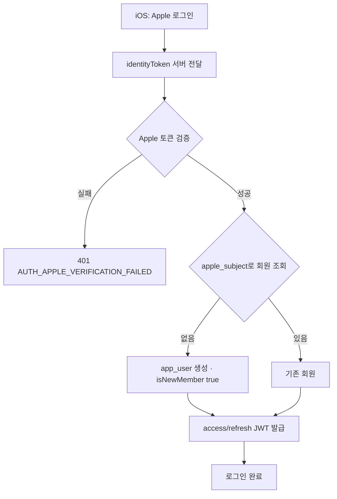
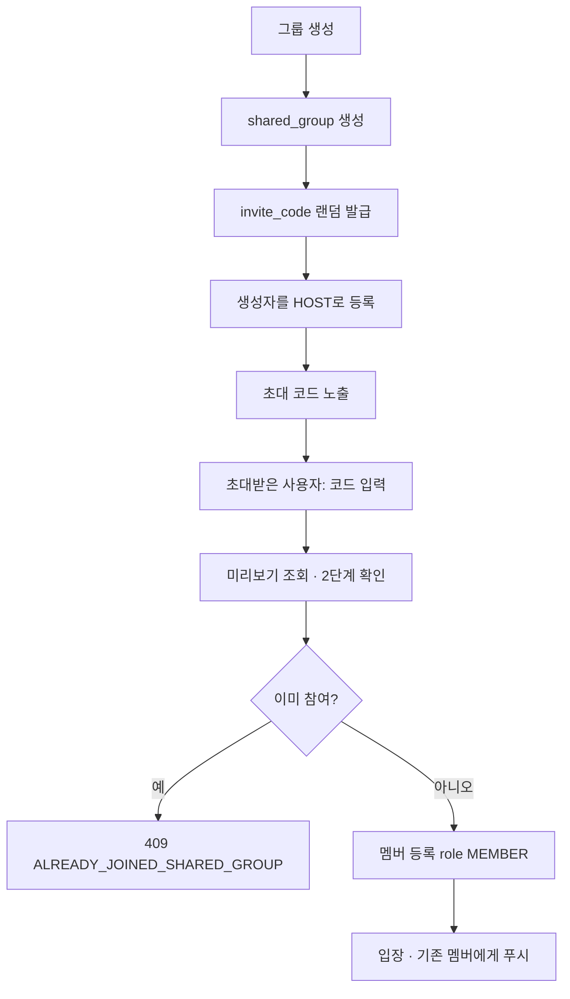
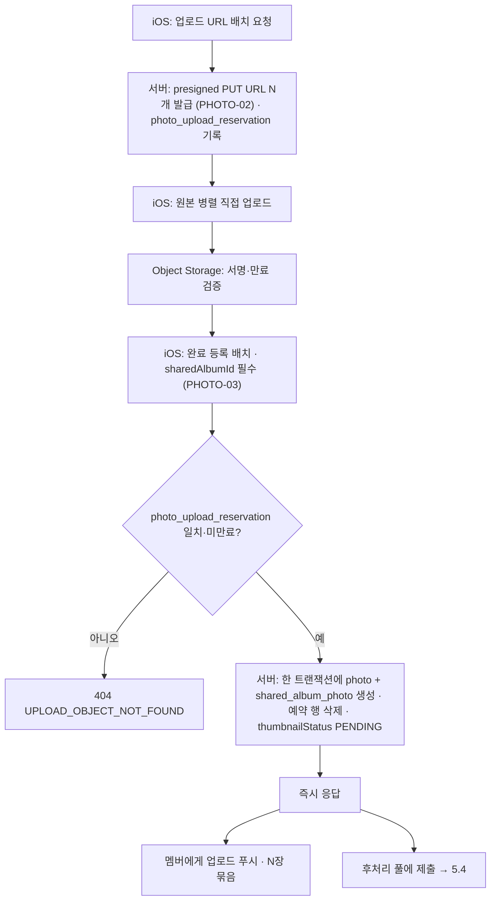
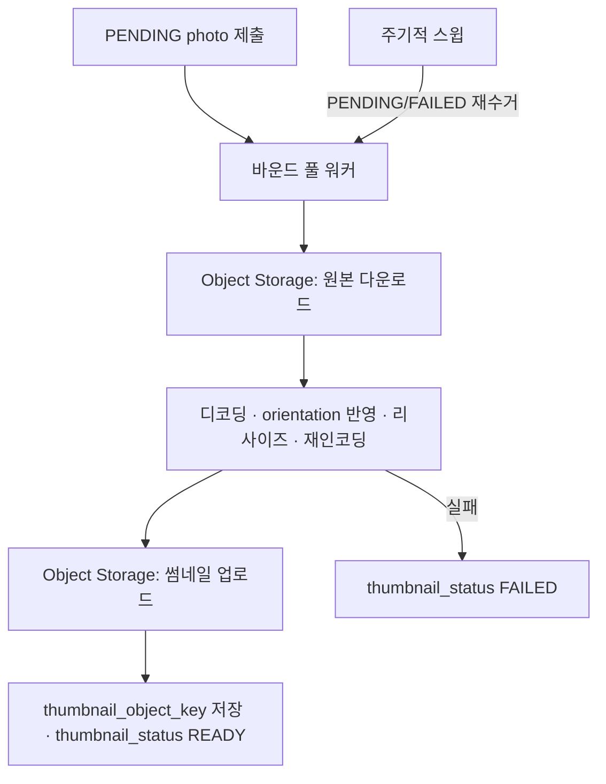
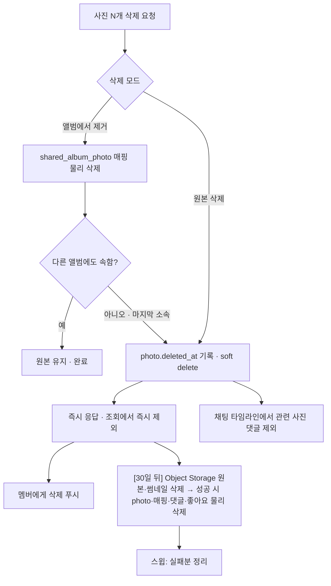
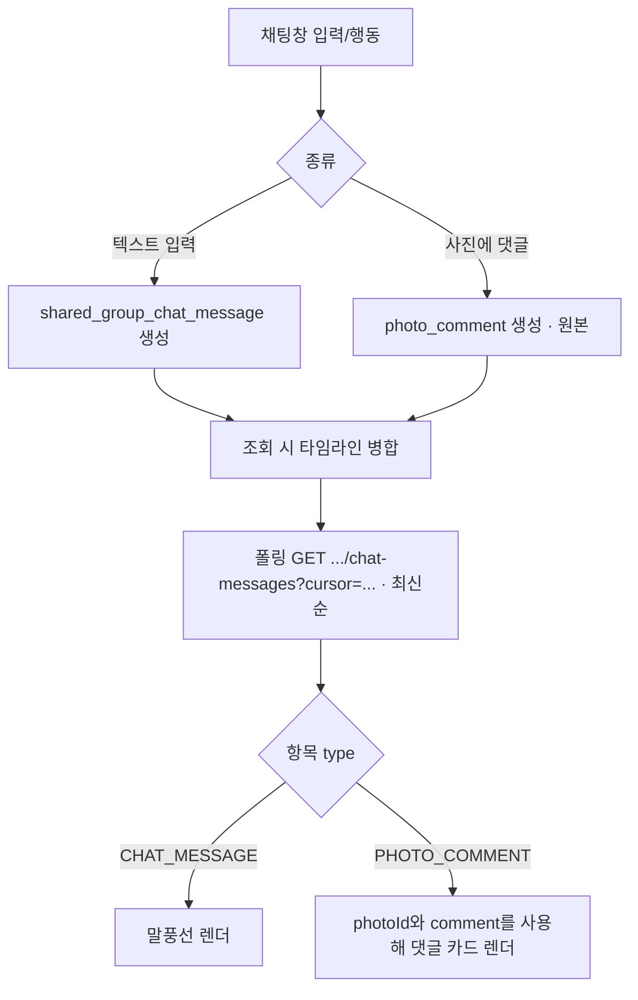
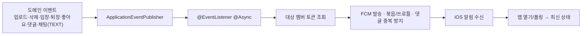
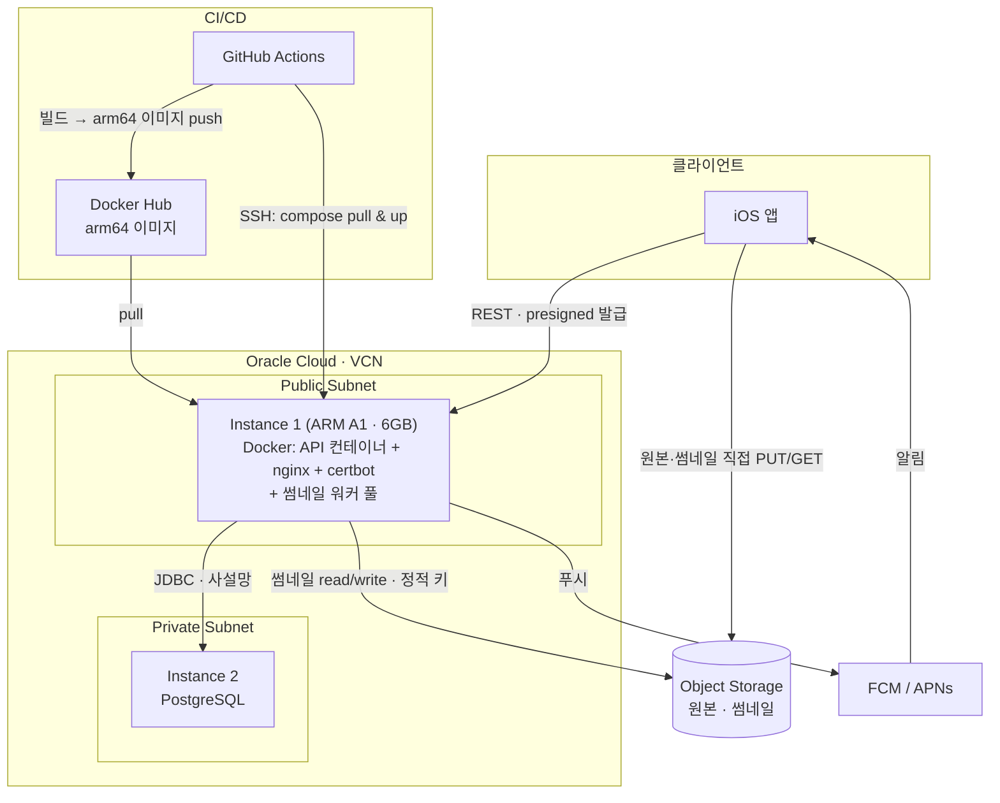
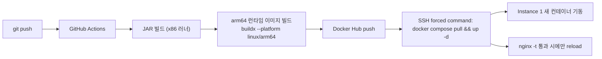

# Zipzip 백엔드 아키텍처 & 배포 문서

> iOS 사진 정리·공유 앱 Zipzip 백엔드의 아키텍처 결정과 배포 구성을 담은 문서.
> 2주 앱잼 MVP 배포를 목표로 하며, 확정된 기능 흐름·배포 토폴로지·운영 주의사항을 포함한다.
>
> 작성일: 2026-07-08 · 대상: 앱잼 MVP 배포
> 이 문서는 `docs/data-modeling/`(ERD, 데이터 사전, 데이터 모델 의사결정 로그)과 `docs/apidoc/`(API 명세, API 설계 의사결정 로그)를 전제로 하며, 스키마·API 세부 계약은 그쪽을 기준으로 한다. 이 문서는 그 위의 아키텍처·배포 층위 결정을 다룬다.

---

## 1. 설계 원칙

- **MVP 우선.** 2주 안에 배포 가능한 핵심 기능에 집중한다. 미래 스케일을 위한 선제적 복잡도는 넣지 않는다.
- **제어 평면과 데이터 평면 분리.** 서버(API)는 얇은 제어 평면(메타데이터·URL 발급·알림)만 담당하고, 무거운 데이터 평면(원본 바이트)은 Object Storage가 직접 처리한다. 이 분리가 작은 인스턴스로 원본 화질 대량 업로드를 감당하는 근거다.
- **동기는 즉시 응답, 무거운 작업은 백그라운드.** 썸네일 생성·스토리지 삭제 같은 무거운 I/O는 응답을 막지 않고 백그라운드로 뺀다.
- **DB가 진실의 원천, 스토리지는 결과적 일관.** 백그라운드 작업이 재시작으로 유실돼도 원본이 스토리지에 먼저 안전하게 놓이므로, 주기적 스윕이 화해(reconcile)한다. 이 원칙 덕에 별도 영속 큐(Redis Queue) 없이도 견고하다.
- **전파는 푸시 + 폴링으로 일원화.** 실시간 채널(WebSocket)을 두지 않는다. "무슨 일이 일어났다"는 FCM 푸시로 알리고, 실제 최신 콘텐츠는 클라이언트가 새로고침/폴링으로 받는다. **사진 동기화와 채팅 모두 이 모델을 따른다.**
- **과설계 거부.** Kafka, ELK, 별도 ML 서버, WebSocket, 별도 워커 인스턴스는 현재 규모에 과하다고 판단하여 채택하지 않는다.

## 2. 확정 기능

**필수**

- 공유 그룹(공유집) & 공유집(앨범): 생성, 초대, 입장, 퇴장
- 사진 업로드(원본 화질) / 조회 / 상세 / 삭제
- 좋아요, 댓글
- **채팅 = 통합 활동 피드** (폴링): 순수 텍스트 메시지 + "사진에 댓글 달림" 이벤트가 한 스트림에 섞여 흐름
- 푸시 알림: 업로드, 삭제, 입장, 퇴장, 좋아요, 댓글, 채팅 메시지
- 권한 관리 (역할 기반)

**선택 / 보류**

- 콘텐츠 해시 기반 중복 제거(dedup): 컬럼만 선반영, 로직은 Phase 2
- 라이브 포토: 정지본(JPEG)만 취급, 영상 페어링은 Phase 2

**의도적으로 제외**

- 실시간 동기화(WebSocket): **사진·채팅 모두 폴링 + 푸시로 대체** (전면 제거)
- 휴지통 / 최근 삭제 목록: 사진 원본·공유집(앨범)·공유 그룹은 soft delete 후 30일 뒤 물리 정리하되 사용자 복구 UI는 제공하지 않는다. MVP에는 사진 댓글·그룹 채팅 메시지의 사용자 삭제 API를 제공하지 않으며, 두 행은 상위 사진·공유 그룹 정리 시 함께 삭제한다. (자세한 근거는 [4.6](#46-사진--앨범-nm--삭제-정책) 참고)
- 서버측 메타데이터 추론: iOS가 처리, 서버는 저장만
- HEIC 서버 디코딩: iOS가 JPEG로 업로드해 회피

## 3. 기술 스택

| 영역 | 선택 | 비고 |
| --- | --- | --- |
| 언어/런타임 | Java 21 | Virtual Threads로 I/O 동시성 |
| 프레임워크 | Spring Boot 3.5 | 4.x는 일정 대비 레퍼런스 부족으로 제외 |
| 빌드 | Gradle |  |
| RDB | PostgreSQL | 별도 인스턴스(private) |
| 파일 저장소 | Oracle Object Storage | S3 호환 API, presigned URL |
| 이미지 처리 | Java ImageIO | 원본을 **JPEG**로 받아 네이티브 라이브러리 불필요 |
| 푸시 | Firebase Cloud Messaging / APNs |  |
| 캐시 | Redis (선택) | 폴링 채팅 최근 메시지 캐시가 유력한 첫 도입 사유 |
| 호스팅 | Oracle Cloud Always Free | **ARM Ampere A1, 6GB RAM** 기준 |
| 컨테이너 | Docker + Compose | 단일 API 컨테이너 + nginx(TLS 종료) + certbot |
| 레지스트리 | Docker Hub | GitHub Actions 통합 편의. OCIR/GHCR은 Phase 2 |
| CI/CD | GitHub Actions | push → arm64 이미지 → Docker Hub → SSH 배포 |
| 인증(사용자) | Sign in with Apple + JWT |  |
| 인증(스토리지) | S3 Customer Secret Key + 환경변수 | 인스턴스 프린시펄은 Phase 2 |

## 4. 핵심 아키텍처 결정

각 결정은 **맥락 → 결정 → 근거** 순으로 기록한다.

### 4.1 원본 업로드 — Presigned URL 직접 업로드

**맥락.** 원본 화질이 변형 없이 업로드되어야 하고, 여러 사용자가 동시에 대량으로 올린다. 제한된 인스턴스 RAM으로 대용량 원본을 프록시하면 서버가 위험하다.

**결정.** 원본을 API 서버로 스트리밍하지 않는다. 서버는 스토리지 접근 자격을 갖고, 클라이언트가 자격 없이 한 번만 쓸 수 있는 **서명된 임시 URL(presigned URL)** 을 발급한다.

- iOS가 업로드 URL 요청 → 서버가 "PUT · 이 객체 키 · N분 만료" 조건을 서명해 URL 반환하고, 발급한 객체 키를 요청 사용자·대상 앨범·만료 시각과 함께 `photo_upload_reservation`에 예약해 둔다
- iOS가 그 URL로 원본을 Object Storage에 **직접 PUT** (서버를 거치지 않음)
- 서명 검증은 API 서버가 아니라 **Object Storage** 가 수행
- 완료 등록은 `photo_upload_reservation`에서 발급 대상(요청 사용자·앨범)이 일치하고 만료되지 않은 예약을 확인한 뒤에만 `photo` 행을 생성하고, 성공하면 그 예약 행을 지운다. 이 확인이 없으면 다른 사용자·다른 앨범에 발급된 객체 키나 이미 등록에 쓰인 객체 키도 그대로 등록될 수 있다
- 다운로드도 대칭으로 presigned **GET** URL 발급 (원본·썸네일 모두)

**근거.** 파일 트래픽이 서버 메모리·대역폭을 전혀 쓰지 않는다. 이 구조가 없으면 원본 화질 대량 업로드 자체가 불가능하다. IAM은 **서버 한 곳**에만 필요하며 사용자 수와 무관하다(사용자는 서명된 URL만 받을 뿐 IAM 신원이 없다). 예약 테이블은 Object Storage 서명 검증이 놓치는 "발급 대상이 맞는가·재사용은 아닌가"를 DB 트랜잭션으로 보강한다.

**주의.** 업로드는 성공했는데 완료 등록이 실패하면 orphan 객체가 생긴다. MVP에선 감수하고 스윕으로 정리(만료된 미완료 `photo_upload_reservation`도 같은 스윕이 정리). 업로드 제약(content-length·content-type)은 서명에 포함, 만료는 짧게, 객체 키는 UUID 기반.

이 결정의 API 계약은 `docs/apidoc/07-photo-management.md`의 PHOTO-02(업로드 URL 발급)·PHOTO-03(완료 등록)에, 데이터 모델 근거는 `docs/data-modeling/decisions/data-model-decision-log.md`의 DM-12·DM-13에 있다.

### 4.2 썸네일 — 서버 생성 (JPEG 전제)

**맥락.** iOS는 원본만 전달하고, 그리드용 썸네일은 서버가 만들어야 한다. presigned 구조라 서버는 원본을 다시 내려받아야 한다.

**결정.** 서버가 원본 다운로드 → 디코딩(EXIF orientation 반영) → 리사이즈 → 재인코딩 → 썸네일을 스토리지에 업로드. **iOS가 원본을 JPEG로 업로드**하므로 순수 Java(ImageIO)로 처리 가능하고 HEIC 네이티브 라이브러리가 불필요하다. 원본은 무변형 보관, 썸네일은 별도 키.

**근거.** JPEG 통일로 서버 처리·배포 세팅이 크게 단순해진다(네이티브 의존성 0).

### 4.3 비동기 후처리 — DB 상태 + 바운드 풀 + 스윕 (Redis Queue 없음)

**맥락.** 썸네일 생성은 무겁고, 대량 동시 디코딩은 메모리를 크게 쓴다. CI/CD가 배포마다 재시작을 일으켜 진행 중 작업이 유실될 수 있다.

**결정.**

- **잡 상태를 DB 컬럼으로:** `photo.thumbnail_status ∈ {PENDING, READY, FAILED}`
- **동시성 캡:** `@Async` 무제한 금지, `ThreadPoolTaskExecutor`로 동시 디코딩 수를 인스턴스 자원에 맞춰 제한(6.7 참조).
- **인프로세스 워커:** 별도 프로세스/인스턴스가 아니라 API와 같은 프로세스의 바운드 풀. 프로세스 분리가 없으므로 릴레이도 불필요.
- **스윕:** 재시작으로 인메모리 큐가 날아가도 원본은 안전하므로, 주기적 스윕이 `PENDING`/`FAILED`를 재처리.

**근거.** 썸네일 잡은 유실돼도 원본으로 재생성 가능하다. 원본이 이미 영속화돼 있다는 사실을 지렛대 삼아, Redis Queue 없이 DB 상태만으로 "재시작 견딤"을 얻는다.

### 4.4 실시간 미도입 — 전면 폴링 + 푸시

**맥락.** 초기엔 WebSocket으로 실시간 반영을 고려했으나, 사진 동기화와 채팅 모두 실시간 채널 없이 가기로 확정했다(채팅은 폴링 채택).

**결정.** **WebSocket/STOMP 계층을 전혀 두지 않는다.** 변경 전파는 **① FCM 푸시로 이벤트를 알리고 → ② 클라이언트가 새로고침/폴링으로 최신 상태를 조회**하는 방식으로 통일한다.

- **사진:** 앨범 열기/당겨 새로고침 시 조회 API로 최신 상태 수신
- **채팅:** 채팅방 포그라운드 동안 증분 폴링(cursor 기반, `docs/apidoc/09-chat-realtime.md` CHAT-01 참고)

**근거.** 실시간 채널을 없애면 WebSocket 브로커·세션 관리·Pub/Sub 백플레인·인스턴스 분리 고민이 통째로 사라진다. 서버는 순수 REST + 백그라운드 썸네일만 하는 단순 형태로 굳는다. Zipzip의 사용 성격상 "열면 최신"이면 충분하다.

### 4.5 푸시 알림 모델

**결정.** 다음 이벤트에 FCM 푸시를 발송한다: **사진 업로드, 사진 삭제, 공유 그룹 입장, 공유 그룹 퇴장, 좋아요, 댓글, 채팅 메시지.**

- 푸시는 이벤트 통지, 최신 콘텐츠는 폴링/새로고침으로 수신.
- 발송은 동기 트랜잭션이 아니라 `ApplicationEventPublisher` + `@EventListener` + `@Async`로 응답 스레드와 분리.
- FCM 자체 재시도(최대 4주)로 알림 전용 Redis Queue는 도입하지 않는다.

**중복 푸시 방지(중요).** 댓글은 채팅 피드에도 나타나므로([4.9](#49-채팅--통합-활동-피드-댓글-참조-모델)), "댓글 이벤트"와 "채팅 메시지"로 **두 번 발송될 여지**가 있다. 댓글은 **댓글 이벤트로만 1회** 푸시하고, "채팅 메시지 푸시"는 순수 텍스트 메시지에만 적용한다.

**스팸 완화.** 좋아요·업로드·삭제 등 빈도가 높거나 다중 처리되는 이벤트는 묶음·쓰로틀(예: "OO님이 사진 N장 업로드", "OO님 외 3명이 좋아요")을 적용한다.

### 4.6 사진 ↔ 앨범 N:M & 삭제 정책

**맥락.** 같은 사진이 여러 공유집(앨범)에 속할 수 있어야 한다.

**결정.**

- 사진과 공유집(앨범)은 **N:M** (`shared_album_photo` 매핑). **사진은 공유 그룹에 직접 속하지 않는다** — 공유 위계(공유 그룹 > 공유집(앨범) > 사진)를 그대로 지키며, 사진은 오직 공유집(앨범)을 통해서만 그룹에 속한다.
- 사진은 항상 **1개 이상의 공유집(앨범)**에 속해야 한다(미분류 사진 없음). 이 불변식이 아래 삭제 캐스케이드의 근거다.
- 공유집(앨범)에서 사진이 빠지는 경우(공유집(앨범) 삭제, 또는 사진을 특정 공유집(앨범)에서 명시적으로 제거) 는 하나의 규칙을 따른다: 대상 `shared_album_photo` 매핑을 즉시 물리 삭제하고, 그 결과 매핑이 0개가 된 사진(= 방금 없앤 것이 마지막 소속이었던 사진)은 원본도 함께 soft delete한다. 다른 공유집(앨범)에 남아 있는 사진은 원본을 그대로 유지한다.
- 사진 원본 삭제(사용자가 직접 "삭제" 액션을 호출하는 경우)는 위 캐스케이드와 별개의 명시적 동작이지만 결과는 같다: `photo.deleted_at`을 기록하는 soft delete다.
- 삭제 정책은 엔티티 성격에 따라 나뉜다.
  - `app_user`, `shared_group`, `shared_album`, `photo`는 **soft delete 후 30일 뒤 물리 정리**한다. 휴지통이나 사용자 복구 UI는 제공하지 않지만, Object Storage 객체 정리와 순서를 맞추기 위한 유예 기간을 둔다.
  - `photo_comment`, `shared_group_chat_message`는 **유예 없이 즉시 물리 삭제**한다. 파일을 참조하지 않아 정리 순서 문제가 없고, 기록성 콘텐츠라 "삭제하면 바로 사라진다"는 사용자 기대에도 맞기 때문이다.
  - `shared_group_membership`, `shared_album_photo`, `photo_like`는 관계 테이블로서 원래도 즉시 물리 삭제 대상이었다.

**근거.** N:M은 사진 재활용을 가능케 한다. "공유 그룹에 사진이 직접 속한다"는 지름길 관계를 두면 공유 위계와 어긋나고, 공유집(앨범) 삭제 캐스케이드("다른 앨범에 있으면 유지, 없으면 삭제")를 표현할 근거도 사라진다. 그래서 사진의 소속 그룹이 필요한 조회는 `shared_album_photo` → `shared_album` → `shared_group` 조인으로만 구하고, 별도 직접 FK는 두지 않는다.
사진·앨범·그룹의 30일 유예는 Object Storage 객체 정리 순서를 보장하기 위한 것이고, 댓글·채팅 메시지는 파일을 참조하지 않으므로 이 유예가 필요 없다.
"항상 1개 이상의 공유집(앨범)에 속한다"는 불변식은 DB 제약이 아니라 서비스 계층(공유집(앨범) 삭제, 사진 제거 처리)에서 강제한다.

자세한 스키마·FK cascade 규칙은 `docs/data-modeling/decisions/data-model-decision-log.md`의 DM-06, DM-09를 참고한다.

**주의.** 원본 삭제는 복구 불가이므로 iOS 삭제 확인 다이얼로그("원본 삭제"는 "N장 영구 삭제" 경고) 필수. 공유집(앨범)에서 사진을 뺄 때도 그것이 마지막 소속이면 사실상 원본 삭제와 같은 결과이므로, iOS는 제거 전 다른 공유집(앨범) 소속 여부를 확인해 안내하는 것을 권장한다. soft delete된 사진의 댓글은 채팅 타임라인 조회에서 제외한다(4.9 참조).

### 4.7 권한 모델 — 역할 기반

**결정.** 공유 그룹 멤버 역할 enum은 `docs/data-modeling/`에서 이미 확정한 2단계를 그대로 사용한다. `role ∈ {HOST, MEMBER}`.

- `MEMBER`: 조회, 좋아요, 댓글, 채팅, 사진 업로드/삭제(원칙적으로 본인이 업로드한 것), 공유집(앨범) 생성·이름 수정
- `HOST`: 공유 그룹을 만든 방장. 위 권한에 더해 멤버 관리, 그룹 삭제, 탈퇴한 생성자·업로더를 대신한 공유집(앨범)·사진 삭제

Spring Security `@PreAuthorize` 또는 서비스 레이어 체크로 강제한다.

**근거.** 조회 전용 멤버(`VIEWER`)나 세분화된 편집 권한(`EDITOR`)을 별도로 두는 3단계 역할 모델도 검토했으나, 채택하지 않고 기존 `HOST`/`MEMBER` 2단계를 유지하기로 확정했다. 현재 제품 범위에서 공유 그룹 멤버는 항상 편집 권한을 가지므로 조회 전용 역할이 필요하지 않고, 역할이 늘어나면 권한 검증 분기와 API 응답의 `myRole` 처리가 함께 늘어난다. 세분화된 역할이 필요해지면 그때 확장한다.

### 4.8 중복 제거(dedup) — 보류

**결정.** `photo.content_hash` 컬럼만 nullable로 선반영하고, dedup 로직은 **Phase 2**로 미룬다. 도입 시 스코프는 **공유 그룹 내로 한정**한다.

**근거.** 진짜 부담은 해싱이 아니라 삭제 시 스토리지 객체 레퍼런스 카운팅이다. 이 복잡도가 해커톤에서 위험하고, iOS 재인코딩으로 exact-dedup 실효성도 낮아 컬럼만 심고 미룬다.

> 현재 `photo` 테이블에는 `content_hash` 컬럼이 아직 추가되어 있지 않다. 실제 스키마 반영은 별도 작업으로 진행한다.

### 4.9 채팅 = 통합 타임라인 (조회 병합 모델)

**맥락.** 공유 그룹 하나가 하나의 채팅방이며, 채팅창에서는 일반 텍스트 메시지와 사진에 작성한 댓글을 같은 시간 흐름으로 보여준다.

**결정.**

- 별도 `chat_room` 테이블은 만들지 않는다. `sharedGroupId`가 채팅방 식별자다.
- 일반 메시지는 `shared_group_chat_message`에, 댓글 원본은 `photo_comment`에 저장한다. `shared_group_chat_message`에 댓글 참조·타입 컬럼을 추가하거나 댓글 이벤트 행을 생성하지 않는다.
- **조회:** CHAT-01은 일반 메시지와 대상 공유 그룹의 활성 사진 댓글을 조인·병합해 반환한다. 항목은 `CHAT_MESSAGE` 또는 `PHOTO_COMMENT` 타입을 가지며, 댓글 항목에는 연결된 사진 식별자 `photoId`를 포함한다.
- **폴링:** 타임라인은 `createdAt` 내림차순, 항목 타입, 항목 ID 순으로 고정한다. cursor는 세 값을 포함한 불투명 값이며, 클라이언트는 응답의 `nextCursor`를 그대로 전달한다.

**근거.** 댓글 원본과 일반 메시지의 저장·권한 모델을 분리한 채, 채팅 화면에는 사용자가 기대하는 하나의 시간 흐름을 제공할 수 있다. 병합 커서는 항목 타입과 ID까지 포함해 두 테이블의 동시 정렬에서도 중복·누락을 방지한다.

**삭제 상호작용.**

- **댓글 수정·삭제:** MVP에서는 제공하지 않는다. 후속 범위에서 API와 권한 정책을 함께 확정한다.
- **사진 삭제:** 사진이 soft delete되면 해당 사진의 댓글도 채팅 타임라인에서 제외한다. 댓글과 사진의 삭제 플레이스홀더는 제공하지 않는다.

## 5. 주요 기능 흐름

### 5.1 인증 (Apple 로그인)

Apple 소셜 로그인만 지원한다. `apple_subject`로 회원을 식별하고 JWT를 발급한다.

### 5.2 공유 그룹 생성 / 초대 / 입장 / 퇴장

생성자는 `HOST`, 신규 입장자는 `MEMBER`. 입장은 2단계 확인. 퇴장 시 일반 멤버는 본인 멤버십 행만 물리 삭제하고, `HOST`는 그룹 나가기를 할 수 없다(그룹 삭제로 처리). 입장·퇴장 모두 기존 멤버에게 푸시.

### 5.3 사진 업로드 (presigned · 배치)

동기로 즉시 끝난다. 원본 바이트는 서버를 안 거친다. 업로더는 로컬 원본을 즉시 표시(낙관적 UI). 대량 업로드는 **배치 API + 병렬 업로드 + 파일 단위 재시도**로 대응(잡 큐가 아니라 왕복 감소가 체감 성능을 좌우).

### 5.4 비동기 썸네일 후처리

백그라운드 처리. 동시성을 인스턴스 자원에 맞춰 캡(6.7). 썸네일 준비는 실시간 전파가 없으므로, 멤버는 새로고침 시 `READY`면 썸네일, `PENDING`이면 플레이스홀더를 받는다. 재시작 시 스윕이 재처리.

### 5.5 사진 조회 / 상세

- **조회(그리드):** 페이지네이션 목록 + 각 **썸네일 presigned GET URL** 배치 반환. `PENDING`은 상태값으로 플레이스홀더. GET URL은 짧은 TTL로 Redis 캐시 가능(선택).
- **상세:** 전체 메타데이터 + **원본 presigned GET URL** + 좋아요 수 + 댓글 반환. 상세에서만 원본(풀 화질) 서빙.

### 5.6 사진 삭제 (2모드)

앨범에서 제거는 `shared_album_photo` 행을 즉시 물리 삭제하는 동기 동작이다. 다른 앨범에도 속한 사진은 원본을 유지하지만, 방금 없앤 매핑이 마지막 소속이었다면 원본 삭제와 같은 결과(soft delete)로 합류한다(4.6 참고).
원본 삭제는 `photo.deleted_at`을 기록하는 soft delete로 즉시 접근을 차단하고, 30일 뒤 Object Storage 객체 삭제가 성공한 경우에만 DB 행을 물리 삭제한다(DB가 진실의 원천, 스토리지는 결과적 일관 — [1](#1-설계-원칙)). 삭제도 멤버에게 푸시하며, 관련 사진 댓글은 채팅 타임라인에서 제외한다(4.9).

### 5.7 좋아요 / 댓글

- **좋아요:** `UNIQUE(photo_id, app_user_id)` 멱등. 중복 시 기존 상태를 그대로 반환(REACTION-02는 멱등 API). 좋아요 시 푸시(묶음·쓰로틀 권장).
- **댓글:** `photo_comment`가 원본이다. 별도 채팅 이벤트 행을 만들지 않고, 채팅 타임라인 조회 시 일반 메시지와 병합한다(4.9).

### 5.8 채팅 타임라인 (통합 조회 · 폴링)

CHAT_MESSAGE와 PHOTO_COMMENT는 조회 시 하나의 타임라인으로 병합된다. 댓글은 복제하거나 채팅 참조 행을 만들지 않는다(4.9). 채팅방 포그라운드 동안 증분 폴링을 사용하며, WebSocket은 후속 범위다.

### 5.9 푸시 알림 파이프라인

## 6. 배포 아키텍처

### 6.1 인프라 토폴로지

핵심: **원본 바이트는 iOS ↔ Object Storage 사이에서만 흐르고 서버(Instance 1)를 거치지 않는다.** WebSocket 관련 요소는 없다.

이 토폴로지는 이미 `deploy/`(compose, nginx, 배포 스크립트 안내)와 `.github/workflows/cd.yml`, `cd-dev.yml`에 구현되어 있다. 아래 6.2~6.6은 그 실제 구성을 정리한 것이다.

### 6.2 Instance 1 (Public Subnet)

- **역할:** Docker Compose로 실행되는 **API 컨테이너 + nginx(TLS 종료) + certbot(인증서 자동 갱신)** 스택(인프로세스 썸네일 워커 풀은 API 컨테이너 안에 포함).
- 공개 IP 보유. iOS REST 요청은 nginx가 받아 API 컨테이너로 프록시하고, GitHub Actions는 forced-command SSH 배포 키로 배포 스크립트만 실행한다.
- **WebSocket 없음, Redis Queue 없음, 별도 워커 프로세스 없음.**
- Redis는 필요 시 컨테이너로 나란히 추가 가능(6GB 여유). 단 MVP엔 미도입.

### 6.3 Instance 2 (Private Subnet)

- **역할:** PostgreSQL 전용. 공개 IP 없음. Instance 1에서 사설망(JDBC)으로만 접근.

### 6.4 외부 서비스

- **Object Storage:** 원본·썸네일. S3 호환 + presigned URL. iOS와 Instance 1 양쪽 접근.
- **FCM / APNs:** 푸시(Instance 1 → FCM → iOS).
- **Docker Hub:** arm64 컨테이너 이미지 저장소(비공개 리포지토리, 서버 pull은 PAT로 1회 로그인).
- **GitHub Actions:** CI/CD.

### 6.5 스토리지 인증 & 보안

- **스토리지 자격(MVP):** **S3 Customer Secret Key(액세스 키 + 시크릿)** 를 발급받아 **서버 환경변수/`.env`** 로 주입한다. 코드·이미지·git에 절대 포함하지 않는다. IAM 다이내믹 그룹/정책 설정은 이 방식에선 불필요하다.
- **Phase 2 업그레이드:** **인스턴스 프린시펄 + 네이티브 PAR** 로 전환하면 디스크에 정적 비밀이 사라지고 로테이션이 자동화된다. 이때 다이내믹 그룹 + IAM 정책을 설정한다.
- **네트워크:** VCN을 public/private 서브넷으로 분리해 DB를 격리한다. **인스턴스 내부 방화벽(iptables/OS)과 OCI Security List/NSG 양쪽**에서 필요한 포트(앱 포트, 443, SSH)를 열어야 한다(OCI 이미지는 기본적으로 대부분 포트를 막아둠 — 자주 놓치는 지점). Instance 2 NSG는 Instance 1의 사설 IP/서브넷에서 오는 DB 포트만 허용한다.
- **버킷:** 비공개(private), 인스턴스와 **같은 리전**. presigned 만료 짧게, 객체 키 UUID 기반.

### 6.6 CI/CD (git push → 자동 반영)

서버에서 clone·build 하지 않는다. 빌드·이미지 생성은 GitHub Actions, 서버는 pull & 재시작만 한다.

- **arm64 함정:** 인스턴스가 aarch64이므로 이미지는 반드시 `linux/arm64`. **JAR은 x86 러너에서 빌드**(바이트코드는 아키텍처 독립)하고, **런타임 이미지만 arm64**로 만들면 느린 에뮬레이션 컴파일을 피한다. 베이스는 멀티아치 JRE(`eclipse-temurin:21-jre`).
- **레지스트리:** Docker Hub. `main` push는 `:latest`/`:{sha}` 태그로, `develop` push는 `:dev`/`:dev-{sha}` 태그로 분리해 prod/dev 이미지가 절대 겹치지 않는다.
- **배포 트리거:** SSH forced command 방식(즉시성·제어). 서버 SSH 키·호스트는 GitHub Secrets. prod·dev는 SSH 키, 시크릿, 서버 스크립트, 컨테이너/서비스명이 전부 분리되어 있다.
- **compose·nginx 설정 배포:** SSH로 파일 내용을 직접 흘려보내지 않는다. GitHub Actions가 `GIT_SHA`만 stdin으로 전달하면, 서버 배포 스크립트가 `raw.githubusercontent.com`에서 해당 커밋의 `deploy/docker-compose.yml`·`deploy/nginx/conf.d/*.conf`를 직접 fetch한다. 배포 키가 유출돼도 실제 리뷰·머지된 커밋 내용만 반영될 수 있어, 임의 compose 설정(호스트 마운트, `privileged` 등) 주입을 막는다.
- **시크릿 배치:** GitHub Secrets(서버 SSH 키·IP·DB 접속정보) / 서버 `.env`·`zipzip-be.env`(DB 접속·스토리지 키). DB 비밀은 이미지·git에 넣지 않는다.
- **재시작 안전:** 배포 재시작이 후처리 잡을 끊어도 DB 상태 + 스윕이 복구한다(4.3).

자세한 배포 스크립트와 파일 구성은 `deploy/README.md`를 참고한다.

### 6.7 용량 · 사이징 (ARM A1 · 6GB 기준)

- 인스턴스 RAM이 **6GB(A1)** 이므로 극한 절약이 필요 없다.
- **썸네일 워커 동시성:** CPU 코어 수를 보며 4~6 정도까지 실측 상향 가능. 대량 업로드 썸네일 처리량이 개선된다.
- **컨테이너 메모리 한도 + JVM 인식(여전히 필수):** 컨테이너에 메모리 한도를 주고 JVM이 이를 인식하도록(`-XX:MaxRAMPercentage`) 설정한다(현재 Dockerfile은 75%로 설정). 6GB이므로 여유 있게 잡되, 썸네일 디코딩용 네이티브 메모리 여유를 남긴다. 이는 메모리 부족 대비가 아니라 JVM이 힙 상한을 오판하지 않게 하는 기본기다.
- **슬림 이미지:** 멀티스테이지 빌드로 최종 이미지는 JRE 슬림. 메모리와 무관한 빌드 위생·배포 속도 차원이다.
- **재시작 정책:** `restart: unless-stopped`.
- **JPEG 확정 효과:** 네이티브 이미지 라이브러리 설치 불필요 → 배포 이미지·프로비저닝 단순.

## 7. API 응답 계약 & 규약

- 응답 형식: `{ status, code, message, data }` (`BaseResponse<T>`)
- `code`는 도메인 프리픽스(예: `PHOTO_LIKE_ALREADY_EXISTS` 성격의 코드는 현재 `PHOTO_NOT_FOUND`, `NOT_PHOTO_UPLOADER` 등 `docs/apidoc/01-common-spec.md` 7절 도메인 오류 코드 표를 따른다)
- 위치 등 메타데이터의 `isInferred`는 iOS 계약 필드(iOS가 판단, 서버는 저장만)
- 패키지: 도메인 중심 `domain/`, `global/`
- 브랜치: `feat/2-login` 형식(Conventional Branch, 중첩 슬래시 회피) — `AGENTS.md` Branch Convention 참고

세부 endpoint·에러 코드·요청/응답 스키마는 `docs/apidoc/`가 기준 문서다. 이 문서와 어긋나면 `docs/apidoc/decisions/api-design-decision-log.md`를 먼저 갱신한 뒤 이 문서를 동기화한다.

## 8. 단계별 롤아웃

| 단계 | 시점 | 내용 |
| --- | --- | --- |
| **MVP** | 앱잼(2주) | 본 문서 전체. 2인스턴스(Docker 단일 API 컨테이너 + PostgreSQL), presigned 업로드(정적 키), 서버 썸네일(JPEG) + DB상태/바운드풀/스윕, N:M 사진-앨범 + soft delete(30일), `HOST`/`MEMBER` 역할, 채팅 통합 타임라인(폴링·조회 병합)과 메시지·댓글 작성. 댓글·채팅 메시지 수정·삭제 API와 WebSocket·Redis Queue는 후속 범위다. CI/CD = GitHub Actions → Docker Hub(arm64) → SSH 배포. |
| **Phase 2** | 이후 | 콘텐츠 해시 dedup(그룹 스코프) 활성화. 필요 시 Redis 도입(**폴링 채팅 최근 메시지 캐시**가 유력 트리거). 스토리지 인증을 **인스턴스 프린시펄 + PAR** 로 전환. 라이브 포토 영상 페어링. 필요 시 OCIR/GHCR 전환. |
| **Phase 3** | 스케일 정당화 시 | 워커/인스턴스 분리 등. (실시간 요구가 새로 생기면 재검토하되 현재 계획엔 없음.) |

## 9. 열린 항목 (확인 필요)

- **라이브 포토:** MVP는 정지본(JPEG)만. `live_video_object_key`(또는 동등한) 컬럼만 선반영해 Phase 2로 영상 페어링을 여는 방식을 권장하되, 아직 스키마에 반영하지는 않았다.
- **콘텐츠 해시 dedup 컬럼:** [4.8](#48-중복-제거dedup--보류)의 `photo.content_hash` 컬럼도 아직 스키마에 없다.

> 참고: "공유 그룹 채팅/WebSocket" 변수는 **폴링 채택으로 종료**되었다(더 이상 열린 항목 아님).
