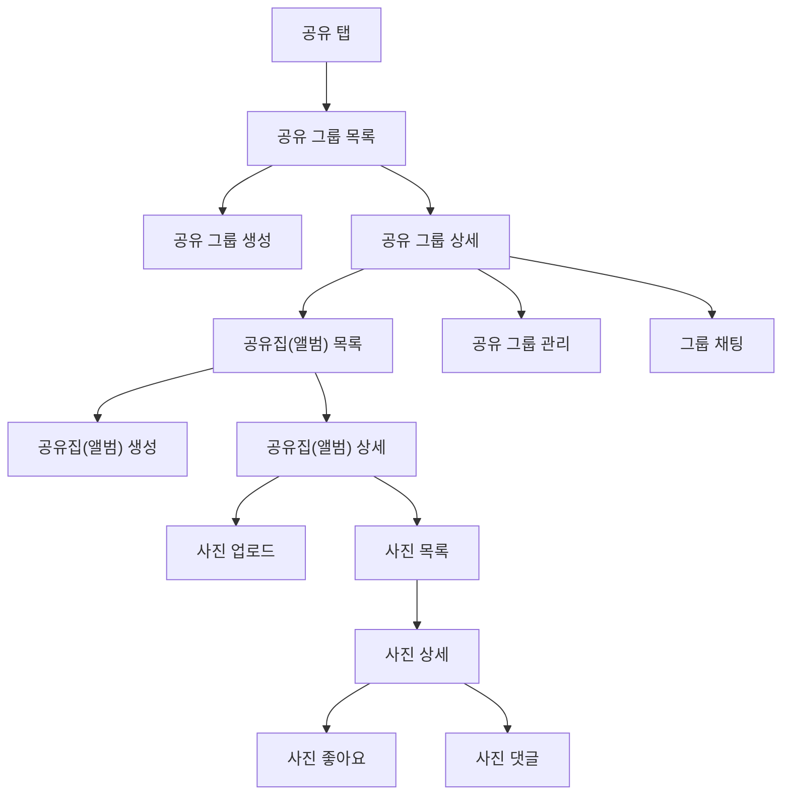

# Zipzip Figma Mid-fi 와이어프레임 컨텍스트

## 1. 문서 목적

이 문서는 Figma mid-fi 와이어프레임 관찰 결과와 사용자가 확정한 서버 범위, 도메인 계층, 테이블 후보를 기록한다.
이후 도메인 용어, 영어 매핑, 데이터 표준화, ERD 작성의 입력으로 사용한다.

## 2. 확정된 공유 흐름

사용자 흐름의 서버 계층은 아래 순서다.

```text
공유 탭
└── 공유 그룹
    └── 공유집(앨범)
        └── 사진
```

- 공유 탭은 여러 공유 그룹을 보여주는 하단 네비게이션 화면이다.
- 공유 그룹은 초대 코드, 멤버십, 그룹 채팅의 기준이다.
- 공유집(앨범)은 공유 그룹 안에서 사진을 담는 단위이다.
- 사진은 공유 그룹에 직접 속하지 않고, `shared_album_photo` 관계 테이블로 하나 이상의 공유집(앨범)에만 속한다.
- 기존 `shared_house` 물리 테이블은 만들지 않고, 공유집(앨범)을 `shared_album`으로 저장한다.

## 3. 서버 저장 대상

| 화면/개념 | 서버 저장 여부 | 서버 모델 |
|---|---|---|
| 공유 탭 | X | UI 화면 |
| 사진집 | X | 로컬 중심 기능 |
| 공유 그룹 | O | `shared_group` |
| 공유 그룹 멤버십 | O | `shared_group_membership` |
| 그룹 채팅 메시지 | O | `shared_group_chat_message` |
| 공유집(앨범) | O | `shared_album` |
| 사진 | O | `photo` |
| 사진 좋아요 | O | `photo_like` |
| 사진 댓글 | O | `photo_comment` |

## 4. 주요 화면 해석

### 4.1 공유 탭

- 하단 네비게이션의 공유 탭은 DB 엔티티가 아니다.
- 현재 사용자가 참여 중인 공유 그룹 목록을 보여준다.
- 공유 그룹 카드 하나는 `shared_group` 한 행에 해당한다.

### 4.2 공유 그룹

- 공유 그룹은 초대 코드로 참여하는 최상위 공유 공간이다.
- 공유 그룹 상세에서는 공유집(앨범) 목록, 그룹 관리, 그룹 채팅으로 진입한다.
- 방장과 멤버는 `shared_group_membership.role`로 구분한다.
- 공유 그룹 정보 수정과 삭제는 방장만 할 수 있다.

### 4.3 공유집(앨범)

- 공유집(앨범)은 공유 그룹 안에서 사진을 담는 하위 공간이다.
- 화면에서는 공유집 또는 앨범 카드로 보일 수 있지만 서버 저장 단위는 `shared_album` 하나로 통합한다.
- 공유집(앨범) 카드 하나는 `shared_album` 한 행에 해당한다.
- 공유집(앨범) 안에는 여러 사진이 표시된다.
- 공유집(앨범) 사진 수는 `shared_album_photo`와 조인한 활성 사진 기준으로 실시간 count한다.
- 공유집(앨범) 삭제 시 해당 앨범-사진 매핑(`shared_album_photo`)은 즉시 물리 삭제한다. 다른 공유집(앨범)에도 속한 사진은 원본이 유지되지만, 마지막 소속이었던 사진은 원본도 함께 soft delete된다.

### 4.4 사진

- 사진은 공유 그룹 안에서 업로드된 이미지 원본이지만, 공유 그룹에 직접 속하지 않는다.
- 사진과 공유집(앨범)의 소속은 `shared_album_photo`로 표현하는 N:M 관계이며, 사진 업로드 시 대상 공유집(앨범)에 매핑을 함께 만든다.
- 사진은 항상 1개 이상의 공유집(앨범)에 속해야 한다.
- 사진 원본은 원칙적으로 업로더만 수정·삭제할 수 있고, 업로더가 탈퇴한 경우 삭제는 공유 그룹 방장이 할 수 있다.
- 공유 사진을 로컬 저장공간으로 복사하는 플로우는 다운로드이며 서버 엔티티를 새로 만들지 않는다.
- 사진을 다른 공유집(앨범)에 추가하거나 제거하려면 `shared_album_photo` 행을 추가·삭제한다. 제거로 마지막 소속이 없어지면 사진도 함께 soft delete된다.

### 4.5 사진 반응과 댓글

- 사진 좋아요는 `photo_like`로 저장한다.
- 한 사용자가 같은 사진에 중복 좋아요를 누르지 못하도록 `unique(photo_id, app_user_id)`를 적용한다.
- 사진 댓글은 `photo_comment`로 저장한다.
- 사진 댓글은 단일 사진에 종속되며, MVP에서는 작성·조회만 제공한다. 수정·삭제는 후속 범위다.
- 사진 댓글은 사진 상세의 댓글 목록과 해당 공유 그룹의 채팅 타임라인에 함께 표시한다.

### 4.6 그룹 채팅

- 공유 그룹 하나를 하나의 채팅방으로 사용하며 별도 채팅방 조회나 `chat_room` 테이블을 두지 않는다.
- 일반 채팅 메시지는 `shared_group_chat_message`, 사진 댓글은 `photo_comment`에 각각 저장한다.
- 채팅 조회는 일반 메시지와 해당 공유 그룹의 활성 사진 댓글을 시간순 타임라인으로 병합한다.
- 1차 구현은 폴링 조회를 기준으로 한다.
- 메시지 작성과 조회는 공유 그룹 활성 멤버십을 요구한다.
- 메시지는 MVP에서 작성·조회만 제공하며, 수정·삭제는 후속 범위다.

## 5. 최종 도메인 계층

```text
공유 탭(UI, 테이블 없음)
└── 공유 그룹(shared_group)
    ├── 공유 그룹 멤버십(shared_group_membership)
    ├── 그룹 채팅 메시지(shared_group_chat_message)
    └── 공유집(앨범, shared_album)
        └── 앨범-사진 매핑(shared_album_photo)
            └── 사진(photo)
                ├── 사진 좋아요(photo_like)
                └── 사진 댓글(photo_comment)
```

## 6. 1차 테이블 후보

```text
app_user
refresh_token
invite_code_reservation
shared_group
shared_group_membership
shared_group_chat_message
shared_album
photo
shared_album_photo
photo_like
photo_comment
```

제외:

| 후보 | 결정 | 이유 |
|---|---|---|
| `shared_house` | 제외 | 공유집(앨범)을 `shared_album`으로 통합한다. |
| `photo_book` | 제외 | 로컬 중심 기능이다. |
| `chat_room` | 제외 | 공유 그룹 하나가 채팅방 하나를 의미한다. 일반 메시지와 사진 댓글은 별도 저장 후 채팅 조회에서 병합한다. |
| `shared_album_like` | 보류 | 좋아요 UI는 사진 중심이다. |

## 7. 확정 전제

1. 공유 탭은 DB 엔티티가 아니다.
2. 공유 탭의 서버 위계는 공유 그룹, 공유집(앨범), 사진 순서이다.
3. 공유집(앨범)은 물리적으로 `shared_album` 테이블에 저장한다.
4. 사진은 공유 그룹에 직접 속하지 않고, `shared_album_photo`로 하나 이상의 공유집(앨범)에만 N:M으로 속한다.
5. 사진은 공유 플로우에서만 서버에 업로드한다.
6. 공유 사진 또는 공유집(앨범)을 로컬 저장공간으로 복사하는 플로우는 다운로드다.
7. 공유 그룹 초대 코드는 공유 그룹이 존재하는 동안 재사용하지 않는다.
8. 멤버 강제 퇴장은 제공하지 않는다.
9. 공유 그룹 하나를 채팅방으로 사용한다. 일반 메시지는 `shared_group_chat_message`, 사진 댓글은 `photo_comment`에 저장하고 1차 구현에서는 폴링으로 병합 조회한다.
10. 사진 댓글은 사진 상세 기능에 속하면서 해당 공유 그룹의 채팅 타임라인에도 시간순으로 표시한다.
11. 공유집(앨범) 사진 수는 `shared_album_photo`와 조인한 활성 사진 기준으로 실시간 count한다.
12. 공유집(앨범) 정보 수정은 활성 공유 그룹 멤버가 할 수 있고, 삭제는 생성자 또는 탈퇴한 생성자의 공유 그룹 방장이 할 수 있다.
13. 사진 원본은 원칙적으로 업로더만 수정·삭제할 수 있고, 업로더가 탈퇴한 경우 삭제는 공유 그룹 방장이 할 수 있다.
14. 사진 댓글과 그룹 채팅 메시지는 MVP에서 작성·조회만 제공하며, 수정·삭제는 후속 범위다.
15. 개별 삭제한 공유집(앨범)·사진과 삭제된 공유 그룹 데이터는 30일 뒤 물리 삭제한다.
16. 사용자 탈퇴 시 `app_user.deleted_at`을 기록하고 `display_name`은 "탈퇴한 사용자"로 갱신한다.
17. 사용자 탈퇴 시 사진 좋아요는 물리 삭제한다.
18. 활성 멤버십은 멤버십 행이 존재하고 상위 공유 그룹과 사용자가 모두 soft delete되지 않은 상태이다.

## 8. 사용자 흐름 요약



## 9. 다음 문서 연결

- `01-domain-terminology.md`: 이 문서의 한글 용어를 정식 도메인 용어로 정리한다.
- `02-korean-english-mapping.md`: 공유집(앨범)을 `shared_album`으로 매핑한다.
- `03-data-standardization.md`: `shared_album_photo` 기준의 FK와 삭제 정책을 정의한다.
- `04-data-modeling.md`: 최종 ERD 테이블과 관계를 확정한다.
