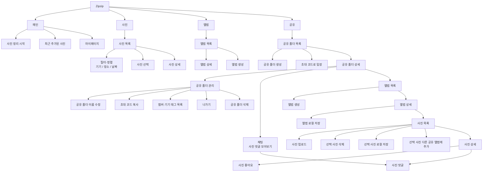

# Figma mid-fi 와이어프레임 서버 모델링 컨텍스트

## 1. 문서 목적

이 문서는 Figma `집집 UI` 파일의 `mid-fi` 와이어프레임을 기준으로 서버 데이터 모델링에 영향을 주는 화면과 기능 맥락을 보존한다.

이 문서는 ERD 확정본이 아니다.
와이어프레임 관찰 결과와 사용자가 확정한 서버 범위, 도메인 계층, 테이블 후보를 기록한다.

후속 문서:

- `01-domain-terminology.md`
- `02-korean-english-mapping.md`
- `03-data-standardization.md`
- `04-data-modeling.md`
- `decisions/data-model-decision-log.md`

## 2. 조회 대상

- Figma 파일: `집집 UI`
- Figma file key: `245lCobPqUHmDygfI5q2ZT`
- 조회 기준 노드: `13:2`
- 조회 기준 노드명: `mid-fi`
- Figma 최상위 페이지명: `표지`

사용자가 말한 `mid-fi page > midfi layer`는 Figma 최상위 Page라기보다 캔버스 안의 `mid-fi` 노드로 확인되었다.

## 3. 서버 모델링 범위

와이어프레임에는 다음 화면군이 섞여 있다.

- 온보딩과 기기 선택
- 메인
- 사진
- 개인 앨범
- 공유 뷰와 공유 폴더 생성·참여·관리
- 공유 폴더 안의 앨범
- 사진 목록과 사진 상세
- 사진 좋아요와 댓글
- 공유 폴더 채팅 뷰

현재 합의에 따라 모든 화면을 테이블로 만들지 않고 로그인 이후 공유 폴더 플로우에서 서버 동기화가 필요한 기능만 모델링한다.

- 로그인 전에는 서버와 상호작용하지 않는다.
- 공유 폴더 플로우에서만 서버에 사진을 업로드한다.
- 개인 앨범과 로컬 사진 정리 플로우는 기기 안에서만 동작한다.
- 로그인 전에 만든 개인 앨범은 Apple 로그인 후 자동 병합하지 않는다.
- 사용자가 명시적으로 공유하려는 경우에만 공유 폴더의 앨범으로 업로드한다.
- 공유 사진이나 공유 앨범을 로컬 저장공간으로 복사하는 플로우는 다운로드이며 서버 엔티티를 새로 만들지 않는다.
- 공유 사진을 같은 공유 폴더의 다른 앨범으로 복사하는 플로우는 사진 원본 복제가 아니라 앨범 포함 관계 추가이다.
- Zipzip 서비스 탈퇴 시 방장으로 만든 공유 폴더는 soft delete하고 `MEMBER`로 참여 중인 멤버십은 물리 삭제한다. 삭제된 공유 폴더의 `HOST` 멤버십은 공유 폴더 물리 삭제 시 FK cascade로 함께 삭제한다.
- 동일한 Apple 계정으로 재가입하면 기존 사용자를 복구하지만 공유 폴더 멤버십은 자동 복구하지 않는다.

## 4. 핵심 화면 해석

### 4.1 공유 뷰

첫 번째 첨부 화면은 하단 네비게이션의 `공유` 탭이다.

관찰 내용:

- 화면 제목은 `공유` 또는 공유 폴더 목록을 의미하는 타이틀이다.
- `집집팟`, `밥은먹고하자`, `똑디팟` 카드가 동시에 표시된다.
- 각 카드에 이름, 생성일, 참여 인원 수, 참여자 표시가 있다.
- 우측 상단에 생성 또는 참여 흐름으로 연결되는 추가 버튼이 있다.

해석:

- 하단 네비게이션의 공유 뷰 자체는 DB 엔티티가 아니다.
- 카드 하나가 서버 엔티티인 공유 폴더 `shared_folder` 하나에 해당한다.
- 한 사용자는 여러 공유 폴더에 참여할 수 있다.
- 공유 폴더 목록은 현재 사용자의 활성 `shared_folder_membership`을 기준으로 조회한다.
- 참여 인원 수는 활성 공유 폴더 멤버십 count로 계산한다.

### 4.2 공유 폴더 내부의 앨범

두 번째 첨부 화면은 하나의 공유 폴더에 들어간 화면이다.

관찰 내용:

- 상단 경로가 `공유 폴더 > 앨범`으로 표시된다.
- 화면 상단의 `밥은 먹고 하자`는 현재 공유 폴더 이름이다.
- `관리`, `채팅` 버튼은 현재 공유 폴더에 대한 기능이다. 여기서 채팅은 공유 폴더 안의 사진 댓글을 모아 보는 화면이다.
- `첫 번째 앨범`, `동아리 앨범`, `상하이 여행`, `강아지` 등 여러 사진 묶음 카드가 표시된다.
- 각 카드에는 표지 이미지와 사진 수가 표시된다.

해석:

- 공유 폴더 `shared_folder` 하나는 여러 앨범 `shared_album`을 가진다.
- 물리 테이블명은 로컬 앨범과의 충돌을 피하기 위해 `shared_album`을 사용한다.
- 별도 `album` 테이블은 필요하지 않다.
- 공유 폴더 방장과 멤버 모두 앨범을 생성할 수 있다.
- 앨범 이름 같은 앨범 정보 수정은 활성 방장과 멤버 모두 할 수 있고, 앨범 삭제는 해당 앨범 생성자만 할 수 있다.
- 사진이 없는 앨범도 존재할 수 있다.
- 한 사진은 여러 앨범에 포함될 수 있으므로 `shared_album_photo`로 앨범과 사진의 포함 관계를 표현한다.

### 4.3 최종 도메인 계층

```text
공유 뷰(UI)
└── 공유 폴더(shared_folder)
    ├── 공유 폴더 멤버십(shared_folder_membership)
    ├── 채팅 뷰(UI, 사진 댓글 모아보기)
    ├── 앨범(shared_album)
    ├── 사진(photo)
    │   ├── 사진 좋아요(photo_like)
    │   └── 사진 댓글(photo_comment)
    └── 앨범 사진 포함 관계(shared_album_photo)
```

## 5. 기능별 관찰과 서버 모델링 시사점

### 5.1 온보딩과 기기 선택

관찰된 문구와 기기 예시:

- `내가 주로 사용하는 기기를 선택해주세요.`
- `목록에 내 기기가 없어요`
- `Canon IXUS 860`
- `iphone 6`, `iphone 6s`

서버 모델링 시사점:

- 로그인 전 선택은 로컬 상태로 관리한다.
- 공유 폴더 관리 화면에서 멤버별 기기 태그가 필요하므로 로그인 이후 사용자 단위 `device`로 동기화한다.
- 기기는 물리 장비 식별자가 아닌 표시용 태그이다.
- 온보딩에서 선택한 주 사용 촬영 기기의 이름만 저장하며 별도 기기 유형은 두지 않는다.
- 사진 EXIF 전체와는 분리하고 `device`와 `photo`를 직접 연결하지 않는다.

### 5.2 하단 네비게이션

관찰된 최상위 탭:

- 메인
- 사진
- 앨범
- 공유

서버 모델링 시사점:

- 메인, 사진, 개인 앨범은 현재 합의상 로컬 중심 기능이다.
- 공유 탭은 여러 공유 폴더를 보여주는 UI이며 테이블로 만들지 않는다.
- 공유 폴더 카드 데이터는 `shared_folder`와 `shared_folder_membership`으로 구성한다.

### 5.3 공유 폴더 생성과 참여

관찰 내용:

- 공유 폴더 이름 입력
- 초대 코드 입력과 복사
- 공유 폴더 생성·참여 확인

서버 모델링 시사점:

- 초대 코드는 `shared_folder.invite_code`에 저장하고 `invite_code_reservation`에 영구 예약한다.
- 초대 코드는 만료되거나 재발급되지 않는다.
- 삭제된 공유 폴더의 초대 코드도 의도적으로 재사용하지 않는다.
- 초대 이력, 초대자 추적, 초대 알림이 필요해지면 `shared_folder_invitation`을 추가 검토한다.

### 5.4 공유 폴더 관리

관찰 내용:

- 공유 폴더 이름 수정
- 생성자와 생성일
- 전체 사진 수
- 초대 코드와 참여자 초대
- 방장 표시와 멤버 목록
- 멤버별 기기 태그

서버 모델링 시사점:

- `shared_folder`는 이름, 최초 생성자, 생성일, 초대 코드와 삭제 상태를 가진다.
- `shared_folder_membership`은 방장 `HOST`와 멤버 `MEMBER` 역할을 가진다.
- 공유 폴더 이름 같은 공유 폴더 정보 수정과 공유 폴더 삭제 권한은 방장에게만 있다.
- 멤버 강제 퇴장 기능은 제공하지 않는다.
- 멤버가 직접 나가면 `MEMBER` 멤버십을 물리 삭제하며, 유효한 초대 코드로 다시 참여할 수 있다.
- 멤버별 기기 태그는 멤버십이 참조하는 사용자의 `device` 목록으로 표시한다.
- 공유 폴더 전체 사진 수는 공유 폴더에 속한 활성 사진을 실시간 count한다.
- 개별 삭제한 사진·앨범과 삭제된 공유 폴더 데이터는 사용자에게 복구 기능을 제공하지 않고 30일 뒤 Object Storage 객체와 DB 데이터를 물리 삭제한다.
- 초대 코드 예약 행은 공유 폴더 물리 삭제 후에도 영구 보존한다.

### 5.5 앨범

관찰 내용:

- 공유 폴더 안의 여러 앨범 카드
- 앨범 생성과 이름 입력
- 앨범 편집과 삭제 확인
- 사진이 없는 빈 앨범

서버 모델링 시사점:

- `shared_album`은 `shared_folder` 하위에 존재한다.
- 방장과 멤버 모두 앨범을 생성할 수 있다.
- 앨범 이름 같은 앨범 정보 수정은 활성 방장과 멤버 모두 할 수 있다.
- 앨범 삭제는 생성자만 할 수 있다.
- 앨범 사진 수는 해당 앨범에 연결된 활성 사진을 실시간 count한다.

### 5.6 사진 목록과 업로드

관찰 내용:

- 앨범 안의 사진 그리드
- 날짜별 사진 묶음
- 사진 선택과 선택 삭제
- 사진 추가와 업로드 확인
- 선택한 사진을 로컬 저장공간으로 복사
- 선택한 사진을 같은 공유 폴더의 다른 앨범으로 복사
- 선택한 앨범을 로컬 앨범으로 복사

서버 모델링 시사점:

- `photo`는 `shared_folder` 하위의 사진 원본이며, `shared_album_photo`가 사진과 앨범의 포함 관계를 표현한다.
- 이미지 파일은 OCI Object Storage에 저장한다.
- DB에는 object key, 원본 파일명, content type, 파일 크기를 저장한다.
- nullable `photo.taken_at`을 촬영일 기준으로 사용하고 없으면 `created_at`을 표시·정렬 기준으로 사용한다.
- 서버는 업로드된 이미지 파일의 EXIF에서 촬영일시만 추출해 `photo.taken_at`에 저장한다.
- EXIF 전체를 DB 컬럼으로 저장하지 않으며, 업로드된 이미지 파일의 EXIF를 제거하지 않고 원본 파일을 Object Storage에 저장한다.
- 로컬 저장공간 또는 로컬 앨범에서 공유 폴더로 사진을 불러오는 플로우는 사진 업로드로 처리한다.
- 공유 사진이나 공유 앨범을 로컬로 복사하는 플로우는 다운로드이며 서버 행을 생성하지 않는다.
- 선택한 사진을 같은 공유 폴더의 다른 앨범으로 복사하는 플로우는 `shared_album_photo` 행을 추가한다.
- 사용자가 선택 사진 삭제에서 `이 앨범에서만 제거`를 고르면 `shared_album_photo` 관계만 제거하고, `사진 원본 삭제`를 고르면 `photo.deleted_at`을 기록한다.
- 사진 원본 수정과 삭제는 업로더만 할 수 있다.

### 5.7 사진 좋아요

- 좋아요는 이모지 타입 없는 단순 좋아요이다.
- `photo_like`는 `photo`, `app_user`를 참조한다.
- 한 사용자가 같은 사진에 중복 좋아요를 누르지 못하도록 `unique(photo_id, app_user_id)`를 적용한다.
- 좋아요 취소는 활성 멤버이면서 해당 좋아요를 누른 사용자만 할 수 있고, 취소 시 행을 물리 삭제한다.

### 5.8 공유 폴더 채팅

- 채팅은 독립 메시지 저장 공간이 아니라 공유 폴더 안의 개별 사진 댓글을 모아 보여주는 뷰이다.
- 별도 `chat_room`, `chat_message` 테이블을 만들지 않는다.
- 채팅 뷰의 목록은 `photo_comment`를 `photo`와 조인해 공유 폴더 범위로 조회한다.
- 채팅 뷰에서 새 글을 작성하는 경우에도 특정 사진 컨텍스트를 가진 `photo_comment`로 저장한다.
- 댓글 작성 가능 여부는 대상 사진이 속한 공유 폴더의 활성 `shared_folder_membership`으로 검증한다.
- 댓글 수정과 삭제는 작성자만 할 수 있다.

### 5.9 사진 댓글

- 단일 사진 상세 화면에서 댓글을 작성한다.
- `photo_comment`는 특정 `photo`와 작성자 `app_user`에 종속된다.
- 공유 폴더 채팅 뷰는 같은 `photo_comment`를 모아 보여준다.
- 사진 댓글 수정과 삭제는 작성자만 할 수 있다.

## 6. 테이블 후보 재검토 결과

현재 1차 서버 ERD 후보는 다음 11개이다.

```text
app_user
refresh_token
invite_code_reservation
shared_folder
shared_folder_membership
device
shared_album
shared_album_photo
photo
photo_like
photo_comment
```

- 테이블 수는 11개로 확정한다.

## 7. 제외/보류 후보

| 후보 | 판단 | 이유 |
|---|---|---|
| `share_view` | 제외 | 하단 네비게이션 UI이며 데이터 엔티티가 아니다. |
| `album` | 제외 | 공유 폴더 내부의 사진 묶음은 `shared_album`으로 모델링한다. |
| `personal_album` | 제외 | 개인 앨범은 로컬 전용 플로우이다. |
| `photo_metadata` | 제외 | 서버가 이미지 EXIF에서 촬영일시만 추출해 nullable `photo.taken_at`에 저장하고 별도 메타데이터 엔티티는 두지 않는다. |
| `shared_folder_invitation` | 보류 | 초대 이력·알림 정책이 확정되기 전에는 `shared_folder.invite_code`로 처리한다. |
| `notification` | 보류 | 알림 화면과 정책이 확정되지 않았다. |
| `shared_album_like` | 보류 | 좋아요 UI는 사진 중심이다. |

## 8. 확정된 추가 결정

1. 사진 좋아요는 단순 좋아요로 시작한다.
2. 기기는 사용자 단위 표시 태그로 관리한다.
3. 날짜별 사진 그룹은 촬영일 기준이며 없으면 생성 시각을 사용한다.
4. 공유 폴더 사진 수는 활성 사진 기준, 앨범 사진 수는 활성 포함 관계와 활성 사진 기준으로 실시간 count한다.
5. 한 사진은 여러 앨범에 포함될 수 있으므로 `shared_album_photo`로 포함 관계를 관리한다.
6. 앨범 정보 수정은 활성 방장과 멤버 모두 할 수 있고, 앨범 삭제는 생성자만 할 수 있다.
7. 사진 원본은 업로더만 수정·삭제할 수 있다.
8. 사진 댓글은 작성자만 수정·삭제할 수 있으며 채팅 뷰도 이 댓글을 사용한다.
9. 멤버 강제 퇴장은 제공하지 않고 나간 멤버는 공유 폴더 초대 코드로 재참여할 수 있다.
10. 공유 폴더 정보 수정과 공유 폴더 삭제는 방장만 할 수 있고 사용자에게 복구 기능을 제공하지 않는다.
11. 개별 삭제한 사진·앨범과 삭제된 공유 폴더 데이터는 30일 뒤 물리 삭제한다.
12. 동일한 Apple 계정으로 재가입하면 기존 사용자를 복구하되 과거 공유 폴더 멤버십은 자동 복구하지 않는다.
13. 초대 코드는 `invite_code_reservation`에 영구 예약해 공유 폴더 물리 삭제 후에도 재사용하지 않는다.

## 9. IA 보완 제안

첨부된 FigJam IA는 작업 중인 초안이므로, 서버 모델링 기준에서는 다음 구조를 우선 참고한다.
하단 네비게이션 depth는 1단계, 각 탭의 주요 목록·상세·관리 흐름은 2~4단계까지 분리한다.



공유 뷰 IA 보완 기준:

- `공유` 탭의 첫 화면은 공유 폴더 목록이다.
- 공유 폴더 생성과 초대 코드 입장은 공유 폴더 목록에서 진입한다. 참여 중인 공유 폴더가 없으면 empty state에서 같은 진입점을 우선 노출한다.
- 공유 폴더 상세는 앨범 목록, 관리, 채팅 뷰로 분기한다.
- 채팅 뷰는 공유 폴더 안의 사진 댓글을 시간순으로 모아 보여준다.
- 공유 폴더 관리에는 이름 수정, 초대 코드 복사, 멤버·기기 태그 목록, 나가기, 삭제를 둔다.
- 공유 폴더 삭제는 방장에게만 노출한다.
- 멤버 나가기는 멤버에게만 노출하고, 강제 퇴장 기능은 두지 않는다.
- 공유 폴더 내부 앨범 상세에서 사진 업로드, 사진 선택 삭제, 로컬 저장, 다른 공유 앨범에 추가, 사진 상세로 이어진다.
- 공유 사진·앨범의 로컬 저장은 다운로드이며 서버 엔티티를 만들지 않는다.
- 선택 사진의 다른 공유 앨범 추가는 `shared_album_photo` 포함 관계 추가로 처리한다.
- 선택 사진 삭제는 `이 앨범에서만 제거`와 `사진 원본 삭제`를 사용자 선택으로 분기한다.
- 사진 상세의 좋아요와 댓글은 사진 단위 기능이고, 채팅 뷰는 사진 댓글의 공유 폴더 단위 모아보기로 둔다.
